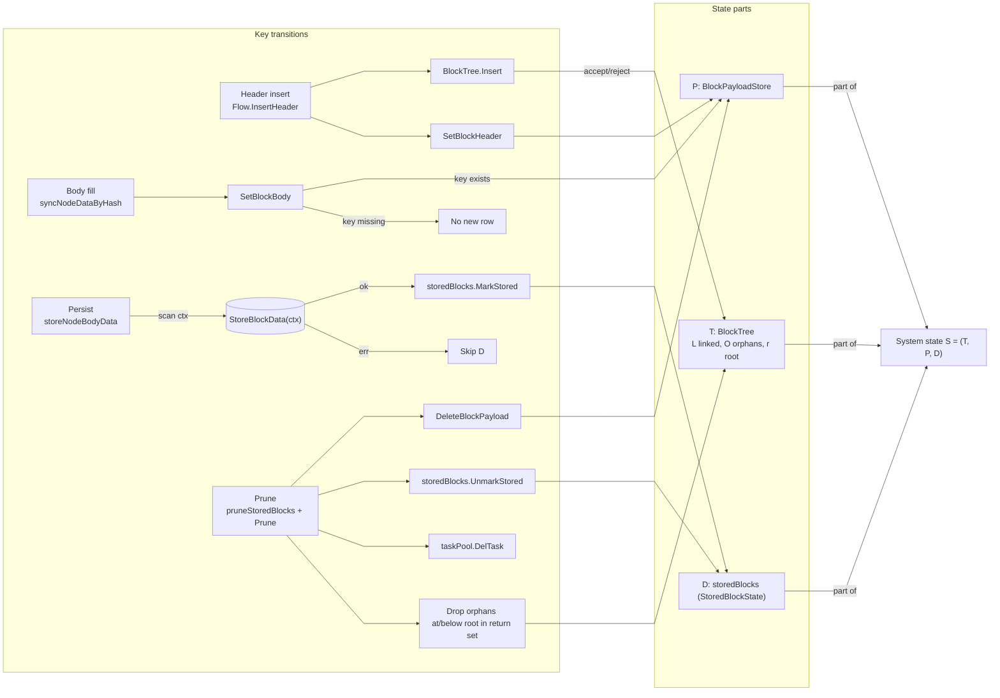
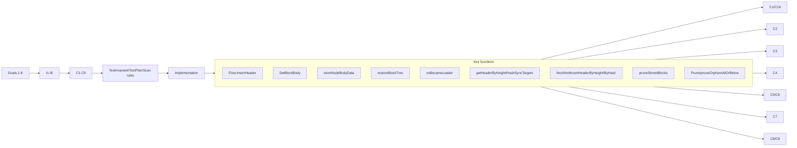
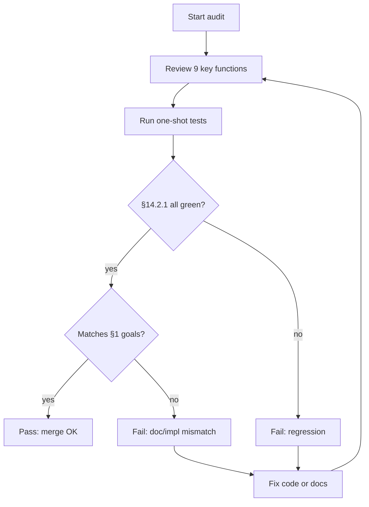

# Fetch data-flow formal verification

Block tree **T** fields and API: [BlockTree.md](BlockTree.md). This document focuses on invariants over global state \(S=(T,P,D)\) and the testing contract.

## 1. Objectives

### 1.1 Scope (overall test contract)

**Overall tests, invariants below, and C1–C9** apply to leader runtime **after** `onBecameLeader` **returns successfully**. At that point `createRuntimeState` has run, DB window restore or `EnsureBootstrapHeader` has completed, the HeaderNotifier pipeline is up, `taskPool.start()` has run, `scanEnabled=true`, and the scan loop is running. We then reason about scan coordination, header/body sync, `Flow.InsertHeader`, `ProcessBranchesLowToHigh` / persist, prune, etc., and their effect on \(S=(T,P,D)\).

**Implementation**: The main orchestration is `onBecameLeader` (`createRuntimeState`, `LoadBlockWindowFromDB`, `restoreBlockTree` or `EnsureBootstrapHeader`, header manager + notifier fan-in, task pool, scan worker). Production “first thing after becoming leader” is wired through this function.

**Unit tests**: Many tests **construct** \(T,P,D\) (plus `storedBlocks`, task pool, …) via `newTestFetchManager` instead of calling `onBecameLeader` every time—equivalent to a snapshot **after** a successful bootstrap in scan-ready state. That isolates scan, prune, and DB paths. **Entry orchestration** is still covered by C7 and `TestOnBecameLeader*`.

1. **Entry conditions** (still tested, but **not** the “steady-state main loop”): Goal 7 and C7, `restoreBlockTree` / `EnsureBootstrapHeader` describe the state **at the end of** `onBecameLeader`, defining initial \(T,P,D\) for the main scope—not every tick of stable leadership.
2. **Snapshots vs main function**: See implementation vs unit-test bullets above; both encode the same leader-ready semantics.
3. **Out of main scope**: Pre-leader `Run`/election wait, `onLostLeader` teardown, follower-only `nodeManager` updates with `scanEnabled=false`—may stay in component tests; **not** folded into C1–C9 “main Fetch experience”.
4. **HeaderNotifier lifecycle**: Notifiers and the channel consumer start only **after** successful `onBecameLeader` bootstrap; `onLostLeader` cancels context, stops notifiers, closes the channel. **I6 / `GetLatestHeight`** tip updates therefore occur **during** leadership; tests such as `TestStartHeaderNotifiersConsumerIgnoresRegressiveRemoteHeight` use notifier wiring + `scanEnabled=false` to isolate tip updates without `Flow.InsertHeader` side effects. **Subscription headers are not used as full headers**; see §3.7.

The following behaviors are required:

1. Header insert goes through the block tree first; if insert is rejected, tree state is unchanged.
2. `BlockPayloadStore` holds pending header/body cache; it does **not** claim to be the complete set of “not yet persisted” work.
3. `storedBlockState` records completed hashes from successful runtime stores **or** `Complete` rows during restore.
4. In leader runtime, when a node is `parentReady` and body is storable, a successful `Store` leads to `storedBlockState`.
5. Prune return set hashes must be cleared consistently from `BlockPayloadStore`, `storedBlockState`, and `taskPool`.
6. Prune also removes orphans with height \(\le\) root height; those hashes are included in the prune return set.
7. **(Entry)** On `onBecameLeader`, prefer DB window to init the tree; empty window falls back to remote `startHeight` bootstrap (success ⇒ §1.1 main scope).
8. **(Main)** Scan enumerates height/hash header sync targets from the current tree and runs the corresponding sync to convergence.

## 2. State model

Global state:

$$
S = (T, P, D)
$$

where:

1. **Block tree**  
$$
T = (L, O, r)
$$
\(L\): linked nodes; \(O\): orphans; \(r\): current root height.

2. **BlockPayloadStore**  
$$
P: Hash \to (Header, Body)
$$
If a hash is absent from \(P\), there is no pending payload.

3. **storedBlockState**  
$$
D \subseteq Hash
$$
“Completed” hashes from:

1. Runtime success after `StoreBlockData`.
2. Restore from DB window with `Complete=true`.

### 2.1 StoredBlockState semantics (implementation)

Maps to `storedBlockState` (`fetch/store/stored_block_state.go`):

$$
D = \{k \mid k \text{ is a key in the `hashes` map}\}
$$

Transitions:

1. `Reset()` → \(D' = \varnothing\).
2. `IsStored(hash)` with \(k = normalizeHash(hash)\): false if \(k=\)""; else \(k \in D\).
3. `MarkStored(hash)`: if \(k=\)"" then \(D'=D\); else \(D' = D \cup \{k\}\).
4. `UnmarkStored(hash)`: if \(k=\)"" then \(D'=D\); else \(D' = D \setminus \{k\}\).
5. Concurrency: mutex-linearized updates; lazy map init on `MarkStored` when `hashes==nil`.

### 2.2 Leader runtime wiring (`FetchManager`)

Production and tests share the same **logical** \(S=(T,P,D)\); the **physical** layout is:

1. **`FetchManager`** holds flattened pointers: `blockTree *BlockTree`, `pendingPayloadStore *PayloadStore`, `storedBlocks *StoredBlockState`, `taskPool *Pool` (since the mutex-copy fix, these are **pointers**, not values containing `sync.Mutex`).
2. **`fetchRuntimeState`** (`fetch/runtime_state.go`) mirrors the active leader session: same pointers as the flattened fields after `createRuntimeState`.
3. **`buildTreeRuntimeDeps()`** (`fetch/fetch_manager.go`) builds **`store.TreeRuntimeDeps`** once per call: `BlockTree`, `PayloadAccessor`, `StoredBlocks`, `taskPool` (as `TreeTaskPool`), `NormalizeHash`, `ParseWeight`. **`prune_state`** (`capturePruneStateSnapshot`, `pruneStoredBlocks`, `storedHeightRangeOnTree`) and **`scanFlowRuntimeDeps`** both use this helper so prune and scan see **identical** \(T,P,D\) wiring.
4. **`deleteRuntimeState` / `syncRuntimeFields`** (no runtime): flattened `storedBlocks`/`taskPool` reset to **fresh** empty `StoredBlockState` and `Pool` on heap so helpers like `HeaderSyncCounts` stay callable without nil deref (see `fetch/runtime_state.go`).

**I9 (implementation alignment).** For a non-nil leader `FetchManager`, `capturePruneStateSnapshot()` equals `buildTreeRuntimeDeps().CapturePruneStateSnapshot()`, and `storedHeightRangeOnTree()` agrees with `buildTreeRuntimeDeps().StoredHeightRangeOnTree()`. Checked by `TestFormalCapturePruneEqualsBuildTreeDepsSnapshot` and pointer-identity tests in `fetch/formal_verification_test.go`.

## 3. Key transitions

### 3.1 Header insert

Input header \(h\), key \(k\).

1. `BlockTree.Insert(height, k, parent, weight, irreversible)` — `Flow.InsertHeader` passes `irreversible == nil` (see `fetch/scan/flow.go`).
2. `PayloadStore.SetHeader(k, nil)` — header insert never leaves a cached full header for body work; body path refetches via RPC.
3. New-head channel: `FetchAndInsertHeaderByHashImmediate(blockHash)` (full RPC header) updates the tree only; it does not use the slim `RemoteHeader` alone.

Effects:

1. If the tree accepts insert, \(k\) enters \(L\) or \(O\).
2. If rejected (duplicate key, height rules, …), \(T\) may be unchanged.

Code: `fetch/scan/flow.go` `InsertHeader`, `FetchAndInsertHeaderByHashImmediate`; `fetch/runtime_components.go` notifier consumer; `fetch/fetch_manager.go`.

### 3.2 Body fill

Input converted full block \(b\) for hash \(k\).

1. Body sync path checks the node exists in the tree (scan `Flow` + tree deps).
2. Build `EventBlockData`.
3. `PayloadStore.SetBody` / header refresh through the payload accessor when allowed.

Constraint: `SetBody` does **not** create a new entry if \(k \notin dom(P)\).

Code: `fetch/scan/flow.go`; `fetch/store/payload_store.go`.

### 3.3 Persist

When `parentReady` and body is storable:

1. `StoreBlockData(ctx, blockData)` via `Flow.ProcessBranchesLowToHigh` → `StoreWorker.Submit` → `SerialWorker` (`ctx` from scan loop; cancelled on lost leader / worker stop).
2. On success: `StoredBlockState.MarkStored(k)` in `fetch/store/serial_worker.go`.

Code: `fetch/scan/flow.go` (`ProcessBranchesLowToHigh`); `fetch/store/serial_worker.go`.

### 3.4 Prune

1. `BlockTree.Prune(count)` → `prunedNodes`.
2. For each returned \(k\): `DeleteBlockPayload(k)`, `UnmarkStored(k)`, `taskPool.delTask(k)`.

`Prune` also removes orphans with `height <= root.Height` and includes them in `prunedNodes`.

Code: `blocktree/block_tree.go`, `fetch/store/tree_runtime.go` (`TreeRuntimeDeps.PruneStoredBlocks`), `fetch/prune_state.go` (delegates through `buildTreeRuntimeDeps`).

### 3.5 Bootstrap restore

After leadership:

1. `LoadBlockWindowFromDB(ctx)` (`onBecameLeader` passes election `ctx`).
2. `restoreBlockTree(windowBlocks)`.
3. Non-empty window ⇒ init tree + stored state from restore.
4. Empty window ⇒ `EnsureBootstrapHeader()` remote fetch at `startHeight`.

Code: `fetch/fetch_manager.go` `onBecameLeader`, `fetch/restore_tree.go`, `fetch/scan/flow.go` `EnsureBootstrapHeader` (exported name varies; see adapter `scanFlowRuntimeDeps`).

### 3.6 Header sync targets (height/hash)

Each scan coordinator round:

1. Enumerate height targets: `getHeaderByHeightSyncTargets()` from `HeightRange`, window, latest height.
2. Enumerate hash targets: `getHeaderByHashSyncTargets()` from `UnlinkedNodes`.
3. Enqueue header-height / header-hash tasks.
4. Workers run `fetchAndInsertHeaderByHeightCore` / `fetchAndInsertHeaderByHashCore`; success triggers another scan.

Code: `fetch/scan/flow.go`, `fetch/scan/worker.go` / `fetch/scan/task_handler.go` (`HandleTaskPoolTask`), `fetch/task/pool.go`.

### 3.7 Data accuracy: `header_notify` / newHeads vs DB restore

Two entry points can **signal** new work without carrying a full Ethereum block, but **correct persisted data** (tx/logs/etc.) only comes from the normal fetch path. This section records how that split is enforced.

**3.7.1 Header subscription (`newHeads` / HTTP poll).**
`HeaderNotifier` publishes a `RemoteChainUpdate` with `RemoteHeader` (hash, parent, number, difficulty only—**no** transaction hashes/roots list). The consumer **must not** call `insertHeader` with a “slim” object equivalent to a full `BlockHeaderJson` from subscription alone.
Implementation: `fetch/fetch_manager.go` new-head channel handler only passes `BlockHash` into `FetchAndInsertHeaderByHashImmediate(hash)`, which calls `BlockFetcher.FetchBlockHeaderByHash` and then `Flow.InsertHeader` with a **full** header from RPC. Tree structure follows RPC; the subscription is only a **wakeup** for a hash. See `fetch/header_notify/types.go` (`RemoteHeader` comment) and `fetch/scan/flow.go` `FetchAndInsertHeaderByHashImmediate`.
Regression: `TestStartHeaderNotifiersRemoteUpdateUsesBlockFetcherNotSlimHeader` (slim `ParentHash` disagrees with mock RPC; node parent must match RPC).

**3.7.2 `Flow.InsertHeader` and body sync (all header paths).**
Regardless of whether the header first arrived via new-head immediate fetch or height/hash scan, `Flow.InsertHeader` does `SetNodeBlockHeader(k, nil)` so the payload store never treats the insert path as a cache hit for a complete header. The body path then obtains a full header / full block via `BlockFetcher` + node operators (`fetch/fetcher`, `fetch/node`) as wired by `scanFlowRuntimeDeps`. So **no path** uses subscription-only or restore-only state to skip those RPCs for body work.

**3.7.3 DB restore (`restoreBlockTree`).**  
Restore rebuilds the block tree and `D` (stored hashes) from DB rows. For each block: `BlockTree.Insert` with stored metadata; `SetBlockHeader(k, nil)` (same as §3.1—no cached header at startup). `Complete=true` in the row ⇒ `MarkStored(k)`; incomplete rows are not in `D` until a later successful `StoreBlockData` on the scan path. **Accuracy of already-persisted chain data** is an **operational assumption**: we trust the `Complete` bit as set by a prior successful store (I8), not re-validated by counting child table rows on restore. Corrupt DBs require external repair; C1 + §3.7.1–3.7.2 still guarantee **new** fetches and **new** stores go through `BlockFetcher` / `StoreBlockData`.

**Formal-doc placement.**  
Machine-checked pieces already cover the critical mechanism: **C1** (no header cached on `Flow.InsertHeader`); **C3** (restore `Complete` ⇒ `D`); **I1** (membership of `D`). **I8** states the **non–machine-checked** trust boundary for DB rows. **R11.5·8** (residual) notes the gap if `Complete` and child tables disagree.

## 4. Invariants

### I1 Persist correctness

$$
\forall k,\ k \in D \Rightarrow (\text{successful } StoreBlockData(k) \text{ on scan-bound } ctx \lor \text{restored Complete})
$$

Runtime “success” means `StoreBlockData(ctx,·)` **fully** returns without error under the scan `ctx` (cancelled `ctx` or errors do not count); same `ctx` as §3.3 / `syncBodyTarget`. The “restored Complete” disjunct is qualified by the operational trust boundary **I8** and §3.7.3.

### I2 No implicit body row

$$
\forall k,\ k \notin dom(P) \Rightarrow SetBlockBody(k,b) \text{ leaves } P \text{ unchanged}
$$

### I3 Prune cleanup

For prune return set \(R\):

$$
\forall k \in R,\ k \notin D \land k \notin dom(P)
$$

### I4 Orphan heights after prune

New root height \(r\):

$$
\forall o \in O,\ height(o) > r
$$

### I5 Normalized keys in D

$$
\forall k \in D,\ k = normalizeHash(k) \land k \neq ""
$$

### I6 Height sync targets: bounds + dedup

\(H_t\): height targets; \(W\): window size; tree range \([s,e]\); remote tip \(L\).

Non-empty tree, window can grow:

$$
\forall h \in H_t,\ e < h \le \min\big(e + (W-(e-s+1)),\ L\big)
$$

and

$$
\forall h \in H_t,\ \neg isHeaderHeightSyncing(h)
$$

Empty tree:

$$
H_t = \{startHeight\} \text{ or } \varnothing \text{ if that height is already syncing}
$$

### I7 Hash sync targets: validity + dedup

\(Q_t\) targets; \(U\) from `UnlinkedNodes`:

$$
\forall q \in Q_t,\ q \in normalize(U) \land q \neq "" \land blockTree.Get(q)=nil \land \neg isHeaderHashSyncing(q)
$$

### I8 DB `Complete` on restore (operational)

$$
\text{“restored Complete” in I1} \Rightarrow \text{assumed: row was written by a prior full successful } StoreBlockData \text{ (or out-of-band repair)}
$$

Restore does not verify `tx` / other child tables against `Complete`. Consistency of **new** work still follows I1’s runtime arm and C1. See §3.7.3, §11.5·8.

## 5. Preservation

- **§5.1 Header insert**: Touches \(T\); `Flow.InsertHeader` sets pending header accessor to **nil** (body fetch refetches full header via RPC).
- **§5.2 Body fill**: Preserves I2 when key missing; updates `P[k].Body` when present.
- **§5.3 Persist**: I1 preserved; failures skip `MarkStored`.
- **§5.4 Prune**: I3–I4 via `prune_state` + `Prune` orphan rules.
- **§5.5 Restore**: Sets \(T\) and \(D\) from DB; empty DB bootstraps header; preserves I2–I4. `Complete` → \(D\) per I8; no child-table revalidation (§3.7.3).
- **§5.6 Header sync enum**: Success paths align with §5.1; failures do not touch \(D\).

## 6. Alignment with goals 1–8

Goals in §1 match implementation (header/tree, P, D, store, prune cleanup, orphan removal, DB-first bootstrap, height/hash sync).

## 7. Code map

Packages under **`fetch/`**: root orchestration (`fetch_manager.go`, `runtime_state.go`, `prune_state.go`, `restore_tree.go`), **`fetch/scan/`** (Flow, coordinator, adapters), **`fetch/store/`** (payload/stored/prune/`SerialWorker`), **`fetch/task/`**, **`fetch/node/`**, **`fetch/fetcher/`**, **`fetch/header_notify/`**, **`fetch/convert/`**.

Legacy names in older docs (**`scan_flow.go`**, **`sync_block_data.go`** as monolithic files) refer to flows now split across **`fetch/scan/flow.go`** and helpers above.

### 7.1 Audit trace: checks → functions

| Item | Primary | Helpers | Note |
|---|---|---|---|
| C1 header happy path | `Flow.InsertHeader` | `BlockTree.Insert` / `PayloadStore.SetHeader(nil)` | node in T; no cached header row |
| C1b header reject | `Flow.InsertHeader` | same | T unchanged; no header row for rejected key |
| C2 body no implicit row | `PayloadStore.SetBody` | `GetBody` | no silent create |
| C3 D only on success/Complete | `SerialWorker.runRequest` after DB ok / `restoreBlockTree` | `MarkStored` | runtime + restore |
| C4 prune cleans P/D/tasks | `TreeRuntimeDeps.PruneStoredBlocks` | `buildTreeRuntimeDeps` | consistent |
| C5 prune returns orphans | `BlockTree.Prune` | `Prune`/orphans | orphans in return |
| C6 orphan height after prune | `Prune` | | heights > root |
| C7 leader DB-first bootstrap | `onBecameLeader` | load/restore/`EnsureBootstrapHeader` | |
| C8 height targets | Flow height targets | window / tip | |
| C9 hash targets | Flow hash targets | orphans / dedup | |
| I9 deps consistency | `buildTreeRuntimeDeps` | prune + snapshot | §2.2; `TestFormal*` |
| I8 / newHeads | notifier consumer | `FetchAndInsertHeaderByHashImmediate` | not slim `RemoteHeader` (§3.7) |

## 8. Machine-checkable checklist (C1–C9)

### C1 Happy header insert

Pre: valid header \(h\), key \(k\).  
Post: `pendingPayloadStore.GetHeader(k)` is nil (`GetBlockHeader` / typed header accessors in tests)—`insertHeader` does not stash a serialized full header for reuse on the body path.

### C1b Rejected header insert

Pre: tree has root; header rejected by `Insert` (e.g. height \(\le\) root).  
Post: `blockTree.Get(k) == nil` and `pendingPayloadStore.GetBlockHeader(k) == nil`.

### C2 No implicit body row

Pre: \(k \notin dom(P)\).  
Steps: `SetBlockBody(k,body)` then `GetBlockBody(k)`.  
Post: nil.

### C3 D membership

Pre: leader path, node \(k\), mock DB success/fail.  
Post: success ⇒ `IsStored(k)`; fail ⇒ not stored; restore `Complete=true` ⇒ stored.

### C4 Prune clears P/D/tasks

Pre: build tree, seed R in pending/stored/tasks.  
Post: after `pruneStoredBlocks`, for all \(k\in R\): no pending header/body, not stored, no task.

### C5 Prune return includes removed orphans

Pre: main chain; orphan `o1` with height \(\le r\), `o2` with height \(> r\).  
Post: return contains `o1` not `o2`; `o1` removed from orphan set, `o2` remains.

### C6 Orphan heights after prune

Post: \(\forall o \in O_{after},\ height(o) > r\).

### C7 DB-first bootstrap

Cases: non-empty window vs empty.  
Post: restorable tree in both cases.

### C8 Height targets + sync

Predicates as in §I6; successful `sync_height(h)` adds \(h\) to tree heights; range advances within window rules.

### C9 Hash targets + sync

Predicates as in §I7; successful parent fetch links children; failures remain retryable without corrupting tree/D.

## 9. Suggested test names

`TestInvariantHeaderInsertThenPending`, `TestInsertHeaderDoesNotCacheForBodySync`, `TestInvariantSetBlockBodyNoImplicitCreate`, `TestInvariantStoredOnlyAfterSuccessfulStore`, `TestInvariantPruneDeletesPendingAndStored`, `TestInvariantPruneReturnsRemovedOrphans`, `TestInvariantOrphansAboveRootAfterPrune`, `TestOnBecameLeaderUsesDBBootstrapWithoutRemoteFetch`, `TestOnBecameLeaderFallsBackToRemoteBootstrapWhenDBEmpty`, `TestSyncHeaderWindowAndSyncOrphanParents`, `TestGetHeaderByHeightSyncTargetsFormalPredicates`, `TestGetHeaderByHashSyncTargetsFormalPredicates`, `TestHeaderHashSyncFailureLeavesTargetRetryable`, `TestHeightSyncAdvancesExactlyByDerivedTargets`, `TestInvariantI5StoredBlockStateNormalizedClosure`, `TestFormalRuntimePointerIdentity`, `TestFormalBuildTreeRuntimeDepsStablePointers`, `TestFormalCapturePruneEqualsBuildTreeDepsSnapshot`.

## 10. Check ↔ test mapping

**Scope**: C1–C6, C8–C9 and goals 1–6,8 = post-`onBecameLeader` runtime; C7 = entry/bootstrap.

| Check | Test | File(s) | Pass criterion | Status |
|---|---|---|---|---|
| C1 | `TestInvariantHeaderInsertThenPending`; `TestInsertHeaderDoesNotCacheForBodySync` | `fetch/scan_flow_invariant_test.go` | `Get(k)!=nil`, no header row pending for body | done |
| C1b | `TestInvariantHeaderInsertRejectedTreeUnchanged` | same | rejected key absent; no cached header row | done |
| C2 | `TestInvariantSetBlockBodyNoImplicitCreate` | `fetch/store/payload_store_invariant_test.go` | `GetBody`=nil after `SetBody` when key absent | done |
| C3 | `TestInvariantStoredOnlyAfterSuccessfulStore` / `TestRestoreBlockTreeLoadsWindowAndCompleteState` | `fetch/scan_flow_invariant_test.go` / `fetch/fetch_manager_restore_bootstrap_test.go` | success/fail/restore | done |
| C4 | `TestInvariantPruneDeletesPendingAndStored` / `TestScanEventsRule5PruneRemovesStoredAndTasks` | `fetch/prune_invariant_test.go`; `fetch_manager_scan_rules_test.go` | P/D/tasks clean | done |
| C5 | `TestInvariantPruneReturnsRemovedOrphans` | `blocktree/invariant_formal_test.go` | orphans in return | done |
| C6 | `TestInvariantOrphansAboveRootAfterPrune` | `blocktree/invariant_formal_test.go` | heights > root | done |
| C7 | `TestOnBecameLeader*` | `fetch/fetch_manager_restore_bootstrap_test.go` etc. | DB vs remote | done |
| C8 | `TestGetHeaderByHeightSyncTargetsFormalPredicates` / Rule2 | `fetch/scan/flow_targets_test.go`; `fetch_manager_scan_rules_test.go` | window + dedup | done |
| C9 | `TestGetHeaderByHashSyncTargetsFormalPredicates` / Rule3 | `fetch/scan/flow_targets_test.go`; scan rules | hash targets + retry | done |
| I9 | `TestFormal*` | `fetch/formal_verification_test.go` | prune snapshot = deps snapshot; pointers stable §2.2 | done |

### 10.1 Assertion anchors

Minimal assertions per check (C1–C9, I5, I9): same predicates as §8—each `TestInvariant*` / `TestFormal*` / scan-rule test should assert the corresponding bullets (e.g. C1: `Get(k)!=nil` and no pending header payload after `Flow.InsertHeader` alone; C1b: rejected key absent from tree and no header row; etc.).

### 10.2 C8/C9 templates

Templates A–D for height and hash (bounds, continuity, dedup, convergence, failure stability)—same math as §8; apply directly in tests.

### 10.3 Template coverage table

| Template | Primary test(s) | Coverage |
|----------|-----------------|----------|
| C8-A (height target bounds) | `TestGetHeaderByHeightSyncTargetsFormalPredicates` | Full |
| C8-B (height continuity) | `TestGetHeaderByHeightSyncTargetsFormalPredicates` | Full |
| C8-C (height dedup) | `TestGetHeaderByHeightSyncTargetsFormalPredicates` | Full |
| C8-D (height sync convergence) | `TestHeightSyncAdvancesExactlyByDerivedTargets`, `TestScanEventsRule2WindowExpandsToDoubleIrreversible`, `TestSyncHeaderWindowAndSyncOrphanParents` | Full |
| C9-A (hash target validity) | `TestGetHeaderByHashSyncTargetsFormalPredicates` | Full |
| C9-B (hash dedup) | `TestGetHeaderByHashSyncTargetsFormalPredicates` | Full |
| C9-C (hash sync convergence) | `TestScanEventsRule3SyncOrphanParentsByHash`, `TestSyncHeaderWindowAndSyncOrphanParents` | Full |
| C9-D (failure retryable) | `TestHeaderHashSyncFailureLeavesTargetRetryable` | Full |

All C8/C9 templates in §10.2 are fully covered by the tests above.

### 10.4 I1–I9 ↔ tests

| Inv. | Tests |
|---|---|
| I1 | `TestInvariantStoredOnlyAfterSuccessfulStore`, restore tests, `TestPlanP2DBIntermittentFailureThenRecovery` |
| I2 | `TestInvariantSetBlockBodyNoImplicitCreate` |
| I3 | `TestInvariantPruneDeletesPendingAndStored`, `TestScanEventsRule5PruneRemovesStoredAndTasks` |
| I4 | `TestInvariantOrphansAboveRootAfterPrune` |
| I5 | `TestInvariantI5StoredBlockStateNormalizedClosure` (`fetch/store/stored_block_state_invariant_test.go`), `fetch/store/stored_block_state_test.go` |
| I6 | height-target tests, `TestRemoteChainUpdateMonotonicHeight`, `TestNodeManagerResetRemoteChainTips`, `TestStartHeaderNotifiersConsumerIgnoresRegressiveRemoteHeight` |
| I7 | hash-target tests, `TestHeaderHashSyncFailureLeavesTargetRetryable`, `TestScanEventsRule3SyncOrphanParentsByHash` |
| I8 | No dedicated test (operational/DB-repair scope); I1 + C3 on restore; gap §11.5·8 |
| I9 | `TestFormalRuntimePointerIdentity`, `TestFormalBuildTreeRuntimeDepsStablePointers`, `TestFormalCapturePruneEqualsBuildTreeDepsSnapshot` — §2.2 wiring / identical prune vs `buildTreeRuntimeDeps` snapshots |
| §3.7.1 (newHeads) | `TestStartHeaderNotifiersRemoteUpdateUsesBlockFetcherNotSlimHeader`, `TestStartHeaderNotifiersAndConsumerAppliesRemoteUpdate` (`fetch/header_notify_integration_test.go`) |

### 10.5 I9 detail (deps wiring)

Invariant **I9** requires `capturePruneStateSnapshot` / `storedHeightRangeOnTree` / `pruneStoredBlocks` to observe the **same** `TreeRuntimeDeps` as scan (`buildTreeRuntimeDeps` in `fetch/fetch_manager.go`). Regressions that duplicate prune-only wiring are caught by `TestFormal*` in `fetch/formal_verification_test.go`.

Run hints:

1. Minimal (all packages under `fetch/` + `blocktree` invariants):
   `go test ./fetch/... -run '^Test(Invariant|Formal)' -count=1 && go test ./blocktree -run TestInvariant -count=1`
   Note: `go test ./fetch` **only** runs the `fetch` root package; use `./fetch/...` to include `fetch/store`, `fetch/scan`, etc.
2. Full formal suite: §14.2.2
3. Full repo: `go test ./... -count=1 && go build ./...`; race: §11.4
4. Gaps: §11.5

## 11. Change impact & residual risk

### 11.1 Modules touched

`fetch/store/payload_store.go`, `fetch/store/stored_block_state.go`, `fetch/scan/*`, `fetch/prune_state.go`, `fetch/fetch_manager.go`, `fetch/runtime_state.go`, `blocktree/block_tree.go`.

### 11.2 Risks mitigated

Header/tree vs pending drift; implicit body rows; false `stored` after DB fail; dirty P/D/tasks after prune; missing orphans in prune return; orphans below root after prune.

### 11.3 Residual risks (index → §11.5)

| Theme | Mitigation | Gap ref |
|---|---|---|
| Races | locks; P1 `-race` | §11.5·1 |
| Memory/orphans | P4 pressure test | §11.5·2 |
| Recovery/pending | P2/P3/P5 | §11.5·3 |
| External jitter / I6 | `RemoteChain.Update`, `ResetRemoteChainTips` | §11.5·4 |

Notes: I6 uses max tip across nodes; `ResetRemoteChainTips` on each `createRuntimeState` avoids stale high tips after reorg; tests reset remote before changing L.

### 11.4 Routine guards

1. `go test ./... -race -count=1`
2. `go test ./fetch/... -run 'TestPlanP[2345]' -count=1`
3. Light formal: §14.2.1; full merge gate: §14.2.2

### 11.5 Explicit non-coverage list

1. **§11.5·1** Future unsynchronized shared state—not covered until written; use `-race` + review.
2. **§11.5·2** Long-run RSS/GC—P4 ≠ production soak; ops alerts/profiling.
3. **§11.5·3** Multi-dependency outages / hour-long chaos—needs staging/integration.
4. **§11.5·4** Canonical tip regression deep reorg within one leader term without reset—monotonic tip + reset only on `createRuntimeState` may diverge I6 from chain truth until leadership/reset.
5. **§11.5·5** I1 exhaustive proof—all branches not theorem-checked; rely on review + §14.1.
6. **§11.5·6** Real chain/network vs mocks.
7. **§11.5·7** Earlier optional design (set header only after successful `Insert`) is superseded: `Flow.InsertHeader` always ends with `SetHeader(k, nil)` on the payload store for that key.
8. **§11.5·8** If the DB has `block.complete=true` but child rows (e.g. `tx`) are missing, restore still puts \(k \in D\) (I8). Repair is operational (dump/repair); not re-checked at startup. §3.7.1–3.7.2 still protect **new** fetches and stores.

### 11.6 Concurrency & lost leader (async body)

`syncBodyTarget` uses scan `ctx`; cancel on lost leader; nil `blockTree` guards; `StoreBlockData` gets same `ctx`; `StoreFullBlock` workers respect `ctx`—no finalize/`MarkStored` if cancelled mid-flight. Tests: `TestSyncBodyTargetStopsWhenContextCancelled`, `TestStoreFullBlockReturnsEarlyWhenContextAlreadyCancelled`, `TestStoreFullBlockManyTasksSmallChannelNoDeadlock`, `TestStoreFullBlockSkipsFinalizeWhenContextCancelledDuringWorkers`. **Residual**: in-flight SQL may finish; bounded retries may see `context canceled` tail.

## 12. Test plan P1–P6

| ID | Theme | Goal | Command / test | Status |
|---|---|---|---|---|
| P1 | Data races | find races | `go test ./... -race` | done |
| P2 | DB flapping | recover without false stored | `TestPlanP2DBIntermittentFailureThenRecovery` | done |
| P3 | Header disorder | converge | `TestPlanP3HeaderFetchTimeoutAndDisorderConverges` | done |
| P4 | Orphan pressure | bounded orphans | `TestPlanP4OrphanCapacityPressureConverges` | done |
| P5 | Prune/store interleave | T/P/D consistent | `TestPlanP5FrequentPruneAndStoreAlternationConsistency` | done |
| P6 | Context + store | cancel, no deadlock, early exit | body/store/prune/LoadWindow tests in §11.6 | done |

Order (historical): P2→P3→P5→P4→P6. Merge: at least `go test ./...`; periodic `-race`.

**P1 summary**: `BlockPayloadStore` RWLock; atomic/mutex in tests; `StoreFullBlock` interleaved select avoids deadlock; context on write path; test-only `storeFullBlockHookAfterFirstTaskSend`.

## 13. Design choices & optional change

### 13.1 Current behavior

`Flow.InsertHeader`: **Insert then `SetNodeBlockHeader(key, nil)`** on the payload accessor so body sync refetches a full header by hash. New-head path uses `FetchAndInsertHeaderByHashImmediate`.

### 13.2 Optional

Caching a full `BlockHeaderJson` under `P[k]` after `insertHeader` could avoid duplicate `eth_getBlockByHash` on the body path; would need invalidation when new-head or restore overwrites.

## 14. Five-minute audit

**Default**: post-`onBecameLeader` data path; `TestOnBecameLeader*` = bootstrap only.

### 14.1 Read these functions (order)

1. `Flow.InsertHeader` — `BlockTree.Insert` + `SetNodeBlockHeader(key, nil)`; `FetchAndInsertHeaderByHashImmediate` on new heads.
2. `PayloadStore.SetBody` — no create if key missing (`TestInvariantSetBlockBodyNoImplicitCreate`).
3. `Flow.ProcessBranchesLowToHigh` / `SerialWorker` — `MarkStored` only after successful `StoreBlockData`.
4. `restoreBlockTree` — `Complete` → stored.
5. `onBecameLeader` — DB restore vs `EnsureBootstrapHeader`.
6. `Flow` height/hash target enumeration + task pool (`HandleTaskPoolTask`).
7. `FetchAndInsertHeaderByHeight` / `FetchAndInsertHeaderByHash` — convergence.
8. `pruneStoredBlocks` / `TreeRuntimeDeps.PruneStoredBlocks` — consistent cleanup via `buildTreeRuntimeDeps`.
9. `BlockTree.Prune` / orphan rules.

### 14.2 Commands

#### 14.2.1 Light (C1–C7 + prune integration)

One-line regression (full `-run` regex for fetch + blocktree):

`go test ./fetch/... -run 'Test(Invariant(HeaderInsertThenPending|HeaderInsertRejectedTreeUnchanged|StoredOnlyAfterSuccessfulStore|PruneDeletesPendingAndStored)|TestInvariantSetBlockBodyNoImplicitCreate|TestInvariantI5StoredBlockStateNormalizedClosure|TestFormal)|TestRestoreBlockTreeLoadsWindowAndCompleteState|TestOnBecameLeaderUsesDBBootstrapWithoutRemoteFetch|TestOnBecameLeaderFallsBackToRemoteBootstrapWhenDBEmpty|TestScanEventsRule2WindowExpandsToDoubleIrreversible|TestScanEventsRule3SyncOrphanParentsByHash|TestSyncHeaderWindowAndSyncOrphanParents|TestScanEventsRule5PruneRemovesStoredAndTasks' -count=1 && go test ./blocktree -run 'TestInvariant(PruneReturnsRemovedOrphans|OrphansAboveRootAfterPrune)' -count=1`

#### 14.2.2 Full formal regression

```bash
go test ./fetch/... -count=1 \
  -run 'Test(Invariant|Formal)|TestRestoreBlockTreeLoadsWindowAndCompleteState|TestOnBecameLeaderUsesDBBootstrapWithoutRemoteFetch|TestOnBecameLeaderFallsBackToRemoteBootstrapWhenDBEmpty|TestScanEventsRule2WindowExpandsToDoubleIrreversible|TestScanEventsRule3SyncOrphanParentsByHash|TestSyncHeaderWindowAndSyncOrphanParents|TestScanEventsRule5PruneRemovesStoredAndTasks|TestGetHeaderByHeightSyncTargetsFormalPredicates|TestGetHeaderByHashSyncTargetsFormalPredicates|TestHeaderHashSyncFailureLeavesTargetRetryable|TestHeightSyncAdvancesExactlyByDerivedTargets|TestPlanP[2345]|TestRemoteChainUpdateMonotonicHeight|TestNodeManagerResetRemoteChainTips|TestStartHeaderNotifiersConsumerIgnoresRegressiveRemoteHeight|TestStoredBlockState' \
&& go test ./blocktree -count=1 -run 'TestInvariant'
```

Step-by-step (15 commands, audit trail): run each line below in order.

1. `go test ./fetch -run TestInvariantHeaderInsertThenPending -count=1`
2. `go test ./fetch -run TestInvariantHeaderInsertRejectedTreeUnchanged -count=1`
3. `go test ./fetch/store -run TestInvariantSetBlockBodyNoImplicitCreate -count=1`
4. `go test ./fetch -run TestInvariantStoredOnlyAfterSuccessfulStore -count=1`
5. `go test ./fetch/store -run TestInvariantI5StoredBlockStateNormalizedClosure -count=1`
6. `go test ./fetch -run TestFormal -count=1`
7. `go test ./fetch -run TestRestoreBlockTreeLoadsWindowAndCompleteState -count=1`
8. `go test ./fetch -run TestInvariantPruneDeletesPendingAndStored -count=1`
9. `go test ./fetch -run TestScanEventsRule5PruneRemovesStoredAndTasks -count=1`
10. `go test ./fetch -run TestOnBecameLeaderUsesDBBootstrapWithoutRemoteFetch -count=1`
11. `go test ./fetch -run TestOnBecameLeaderFallsBackToRemoteBootstrapWhenDBEmpty -count=1`
12. `go test ./fetch -run TestScanEventsRule2WindowExpandsToDoubleIrreversible -count=1`
13. `go test ./fetch -run TestScanEventsRule3SyncOrphanParentsByHash -count=1`
14. `go test ./fetch -run TestSyncHeaderWindowAndSyncOrphanParents -count=1`
15. `go test ./blocktree -run TestInvariantPruneReturnsRemovedOrphans -count=1`
16. `go test ./blocktree -run TestInvariantOrphansAboveRootAfterPrune -count=1`

#### C8/C9 minimal

`go test ./fetch/... -run 'Test(GetHeaderByHeightSyncTargetsFormalPredicates|GetHeaderByHashSyncTargetsFormalPredicates|HeaderHashSyncFailureLeavesTargetRetryable|ScanEventsRule2WindowExpandsToDoubleIrreversible|ScanEventsRule3SyncOrphanParentsByHash|SyncHeaderWindowAndSyncOrphanParents)' -count=1`

### 14.3 Pass criteria

1. §14.2.1 list passes.
2. §14.2.2 passes for fetch + blocktree.
3. Semantics match §1 goals for the listed functions.
4. Any failure ⇒ formal verification chain broken; fix code or docs before merge.

## 15. Diagrams

### 15.1 State model & transitions



### 15.2 Verification loop



### 15.3 Five-minute audit flow



## See also

- [README.md](README.md) — build, config, documentation index
- [BlockTree.md](BlockTree.md) — block tree **T**: types, API, tests
- [doc/design.md](doc/design.md) — `fetch/` package design (diagrams)
- [doc/README.md](doc/README.md) — index of extra docs under `doc/`
- [doc/test_report_2026-04-23.md](doc/test_report_2026-04-23.md) — latest coverage snapshot
- [doc/test_report_2026-04-13.md](doc/test_report_2026-04-13.md) — historical coverage snapshot
