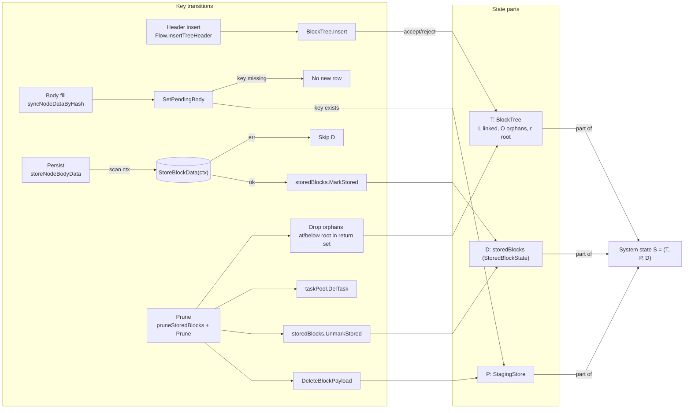
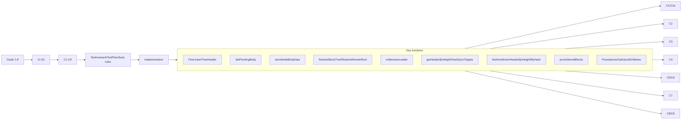
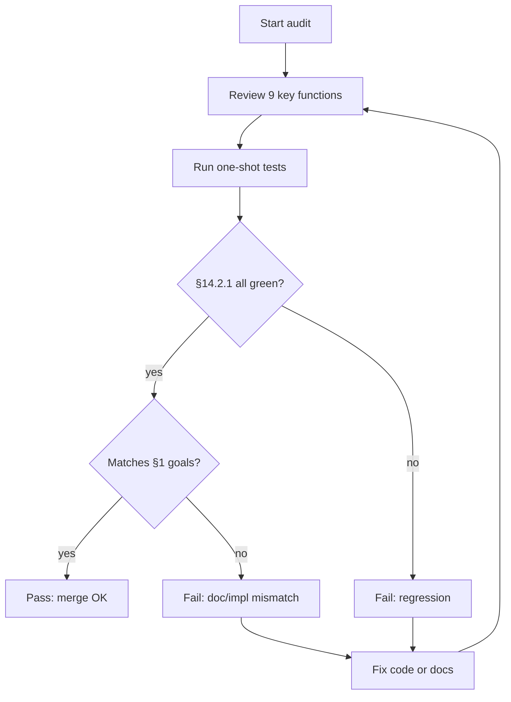

# Fetch data-flow formal verification

Block tree **T** fields and API: [BlockTree.md](BlockTree.md). This document focuses on invariants over global state \(S=(T,P,D)\) and the testing contract.

## 1. Objectives

### 1.1 Scope (overall test contract)

**Overall tests, invariants below, and C1–C9** apply to leader runtime **after** `onBecameLeader` **returns successfully**. At that point `createRuntimeState` has run, DB window restore or remote root restore has completed, the HeaderNotifier pipeline is up, `taskPool.start()` has run, `scanEnabled=true`, and the scan loop is running. We then reason about scan coordination, header/body sync, `Flow.InsertTreeHeader`, store-branch submission / persist, prune, etc., and their effect on \(S=(T,P,D)\).

**Implementation**: The main orchestration is `onBecameLeader` (`createRuntimeState`, `LoadBlockWindowFromDB`, `restore.RuntimeDeps.RestoreBlockTree` or `RestoreRemoteRoot`, header manager + notifier fan-in, task pool, scan worker). Production “first thing after becoming leader” is wired through this function.

**Unit tests**: Many tests **construct** \(T,P,D\) (plus `storedBlocks`, task pool, …) via `newTestFetchManager` instead of calling `onBecameLeader` every time—equivalent to a snapshot **after** a successful bootstrap in scan-ready state. That isolates scan, prune, and DB paths. **Entry orchestration** is still covered by C7 and `TestOnBecameLeader*`.

1. **Entry conditions** (still tested, but **not** the “steady-state main loop”): Goal 7 and C7, `RestoreBlockTree` / `RestoreRemoteRoot` describe the state **at the end of** `onBecameLeader`, defining initial \(T,P,D\) for the main scope—not every tick of stable leadership.
2. **Snapshots vs main function**: See implementation vs unit-test bullets above; both encode the same leader-ready semantics.
3. **Out of main scope**: Pre-leader `Run`/election wait, `onLostLeader` teardown, follower-only `nodeManager` updates with `scanEnabled=false`—may stay in component tests; **not** folded into C1–C9 “main Fetch experience”.
4. **HeaderNotifier lifecycle**: Notifiers and the channel consumer start only **after** successful `onBecameLeader` bootstrap; `onLostLeader` cancels context, stops notifiers, closes the channel. **I6 / `GetLatestHeight`** tip updates therefore occur **during** leadership; tests such as `TestStartHeaderNotifiersConsumerIgnoresRegressiveRemoteHeight` use notifier wiring + `scanEnabled=false` to isolate tip updates without header-sync side effects. **Subscription headers are only scan candidates**: if `scan` verifies they connect continuously to the current tree, they enqueue a header-by-hash task; they never directly extend \(T\) or seed staging block data. See §3.7.

The following behaviors are required:

1. Header insert goes through the block tree first; if insert is rejected, tree state is unchanged.
2. `StagingStore` holds pending header/body cache; it does **not** claim to be the complete set of “not yet persisted” work.
3. `storedBlockState` records completed hashes from successful runtime stores, `Complete` rows during restore, and the current root parent readiness marker described in §2.1.
4. In leader runtime, when a node is `parentReady` and body is storable, a successful `Store` leads to `storedBlockState`.
5. Prune return set hashes must be cleared consistently from `StagingStore`, `storedBlockState`, and `taskPool`.
6. Prune also removes orphans with height \(\le\) root height; those hashes are included in the prune return set.
7. **(Entry)** On `onBecameLeader`, prefer DB window to init the tree; empty window falls back to remote `startHeight` bootstrap (success ⇒ §1.1 main scope).
8. **(Main)** Scan enumerates height/hash header sync targets from the current tree and runs the corresponding sync to convergence.

## 2. State model

Global state:

$$
S = (T, P, D)
$$

where:

1. **Block tree**  
$$
T = (L, O, r)
$$
\(L\): linked nodes; \(O\): orphans; \(r\): current root height.

2. **StagingStore**  
$$
P: Hash \to (Header, Body)
$$
If a hash is absent from \(P\), there is no pending payload.

3. **storedBlockState**  
$$
D \subseteq Hash
$$
“Completed” hashes from:

1. Runtime success after `StoreBlockData`.
2. Restore from DB window with `Complete=true`.
3. Restore/prune root-parent readiness marker: if the current retained root has non-empty `ParentKey`, that parent hash may remain in \(D\) even when it is outside \(T\).

### 2.1 StoredBlockState semantics (implementation)

Maps to `storedBlockState` (`fetch/store/stored_block_state.go`):

$$
D = \{k \mid k \text{ is a key in the `hashes` map}\}
$$

Transitions:

1. `Reset()` → \(D' = \varnothing\).
2. `IsStored(hash)` with \(k = util.NormalizeHash(hash)\): false if \(k=\)""; else \(k \in D\).
3. `MarkStored(hash)`: if \(k=\)"" then \(D'=D\); else \(D' = D \cup \{k\}\).
4. `UnmarkStored(hash)`: if \(k=\)"" then \(D'=D\); else \(D' = D \setminus \{k\}\).
5. Concurrency: mutex-linearized updates; lazy map init on `MarkStored` when `hashes==nil`.

Restore boundary marker:

- After DB restore, remote root restore, and restore-time prune, `restore.RuntimeDeps.MarkRootParentReady()` may add `BlockTree.Root().ParentKey` to \(D\) when it is non-empty.
- This marker means the retained root's parent is a known-ready boundary outside the active tree. It lets `serial_store` persist the retained root without requiring the parent block to be present in the current branch snapshot.
- The marker is not a claim that the parent is retained in \(T\), has pending payload in \(P\), or should be fetched again.

### 2.2 Leader runtime wiring (`FetchManager`)

Production and tests share the same **logical** \(S=(T,P,D)\); the **physical** layout is:

1. **`FetchManager`** holds flattened pointers: `blockTree *BlockTree`, `stagingStore *StagingStore`, `storedBlocks *StoredBlockState`, `taskPool *Pool` (since the mutex-copy fix, these are **pointers**, not values containing `sync.Mutex`).
2. **`fetchRuntimeState`** (`fetch/runtime_state.go`) mirrors the active leader session: same pointers as the flattened fields after `createRuntimeState`.
3. **`scanFlowRuntimeDeps()`** (`fetch/fetch_manager.go`) wires `PruneRuntimeDeps` with the same `BlockTree`, `StagingStore`, `StoredBlocks`, and `TaskPool` pointers used by scan. Hash normalization inside prune/restore/store paths is centralized in `util.NormalizeHash()`. `PruneRuntimeDeps` snapshot/prune helpers therefore observe the same \(T,P,D\) as scan.
4. **`deleteRuntimeState` / `syncRuntimeFields`** (no runtime): flattened `storedBlocks`/`taskPool` reset to **fresh** empty `StoredBlockState` and `Pool` on heap so helpers like `HeaderSyncCounts` stay callable without nil deref (see `fetch/runtime_state.go`).

**I9 (implementation alignment).** For a non-nil leader `FetchManager`, scan runtime deps and prune runtime deps share the same \(T,P,D\) pointers. Checked by `TestFormalRuntimePointerIdentity`, `TestFormalCapturePruneSnapshot`, and `TestFormalScanFlowPruneRuntimeIdentity` in `fetch/formal_verification_test.go`.

## 3. Key transitions

### 3.1 Header insert

Input header \(h\), key \(k\).

1. `BlockTree.Insert(height, k, parent, weight)` — no external irreversible override is accepted.
2. `Flow.InsertTreeHeader` never populates `StagingStore`; full header sync helpers cache the fetched full header after successful tree admission so later body work does not discover headers.
3. New-head channel: `RemoteHeader` is not a full header source. `scan` may use it only to validate a continuous candidate hash and enqueue header-by-hash sync; it does not call `InsertTreeHeader` directly.

Effects:

1. If the tree accepts insert, \(k\) enters \(L\) or \(O\).
2. If rejected (duplicate key, height rules, …), \(T\) may be unchanged.

Code: `fetch/task_process/runtime.go` (`InsertTreeHeader`, header fetch/insert helpers), `fetch/scan/flow_remote_header.go`, `fetch/runtime_components.go` notifier consumer, `fetch/fetch_manager.go`.

### 3.2 Body fill

Input converted full block \(b\) for hash \(k\).

1. Body sync path checks the node exists in the tree (scan `Flow` + tree deps).
2. Build `EventBlockData`.
3. `StagingStore.SetPendingBody` / header refresh through the pending block accessor when allowed.

Constraint: `SetPendingBody` does **not** create a new entry if \(k \notin dom(P)\).

Code: `fetch/task_process/runtime.go`, `fetch/scan/flow_sync_body.go`, `fetch/store/staging_block_store.go`.

### 3.3 Persist

When `parentReady` and body is storable:

1. `scan/flow_store_branch.go` materializes low-to-high full body branches from `BlockTree` and submits them with `StoreWorker.SubmitBranches(...)`.
2. `serial_store/serial_worker.go` traverses each branch serially, requiring the parent to be either already stored or already written earlier in the same branch traversal. It does not depend on `BlockTree` for this decision.
3. `StoreBlockData(ctx, blockData)` is executed by the serial worker; on success it calls `StoredBlockState.MarkStored(k)`.

Code: `fetch/scan/flow_store_branch.go`; `fetch/serial_store/serial_worker.go`.

### 3.4 Prune

1. `BlockTree.Prune(count)` → `prunedNodes`.
2. For each returned \(k\): `DeleteBlockPayload(k)`, `UnmarkStored(k)`, `taskPool.delTask(k)`.

`Prune` also removes orphans with `height <= root.Height` and includes them in `prunedNodes`.

During leader restore, prune is followed by `MarkRootParentReady()`. Therefore the new retained root's parent may be re-added to \(D\) as a readiness boundary even if that hash was part of the pruned context window. This exception is limited to the current root parent marker; other pruned hashes must still be cleared from \(P\), \(D\), and task tracking.

Code: `blocktree/block_tree.go`, `fetch/scan/prune_runtime.go` (`PruneRuntimeDeps.PruneStoredBlocks`).

### 3.5 Bootstrap restore

After leadership:

1. `LoadBlockWindowFromDB(ctx)` (`onBecameLeader` passes election `ctx`) loads a recovery window of `2 * irreversibleBlocks + 1` heights when `irreversibleBlocks > 0`.
2. `RestoreBlockTree(windowBlocks)` sorts the rows by height/hash and inserts them into `BlockTree` without trusting the DB row's `IrreversibleHeight/IrreversibleHash`.
3. Non-empty window ⇒ init tree + stored state from restore, then prune to `irreversibleBlocks + 1` heights.
4. Empty window or unusable DB restore ⇒ `RestoreRemoteRoot(ctx, startHeight)` remote fetch at `startHeight`.
5. After DB restore, remote root restore, and restore-time prune, the current root's non-empty parent hash is kept in \(D\) as the root-parent readiness marker (§2.1). This makes the retained root writable even when its parent is outside the active tree/window.

The `2N+1 → N+1` rule is required because the final goal is not to preserve the full recovery window; it is to guarantee that **all final `N+1` nodes in the restored tree have correct `LinkedNode.Irreversible` values**. If startup loaded only the final `N+1` heights, rebuilding from tree topology would make the oldest retained block treat the recovery root as its irreversible ancestor, even though the correct ancestor may be `N` heights earlier. Loading `2N+1` provides those earlier `N` blocks as temporary computation context. Those earlier blocks are not part of the final restored state and their own irreversible metadata may not match the DB's previously recorded view because still earlier ancestors are absent; therefore restore must prune them and retain only the latest `N+1` heights after the final nodes have cached correct irreversible metadata.

Code: `fetch/fetch_manager.go` `onBecameLeader`, `fetch/restore/runtime.go`, `fetch/scan/prune_runtime.go`.

### 3.6 Header sync targets (height/hash)

Each scan coordinator round:

1. Enumerate expand-tree targets: `GetExpandTreeTargets()` from `HeightRange`, window, latest height.
2. Enumerate fill-tree targets: `GetFillTreeTargets()` from `UnlinkedNodes`.
3. Enqueue header-height / header-hash tasks.
4. Workers run header sync; newly inserted headers enqueue corresponding body tasks in `task_process/runtime.go`.
5. Scan materializes current low-to-high full store-branch targets, backfills missing body tasks for branch nodes without payload, and hands the full branches to the serial store worker.

Code: `fetch/scan/flow.go`, `fetch/scan/flow_expand_tree.go`, `fetch/scan/flow_fill_tree.go`, `fetch/scan/flow_sync_body.go`, `fetch/scan/flow_store_branch.go`, `fetch/scan/worker.go`, `fetch/task_process/runtime.go`, `fetch/task_process/task_process.go`, `fetch/taskpool/pool.go`.

### 3.7 Data accuracy: `header_notify` / newHeads vs DB restore

Two entry points can **signal** new work without carrying a full Ethereum block, but **correct persisted data** (tx/logs/etc.) only comes from the normal fetch path. This section records how that split is enforced.

**3.7.1 Header subscription (`newHeads` / HTTP poll).**
`HeaderNotifier` publishes a `RemoteChainUpdate` with `RemoteHeader` (hash, parent, number, difficulty only—**no** transaction hashes list and not enough block fields for body conversion). This object is treated as a **candidate signal**, not as an insertable header.

Implementation: `fetch/runtime_components.go` updates the node remote tip, then passes the candidate fields to `scan.Flow.EnqueueRemoteHeaderCandidate`. `scan` validates:

1. `update.BlockHash` equals `RemoteHeader.Hash` after normalization.
2. `RemoteHeader.ParentHash` already exists in \(T\).
3. `RemoteHeader.Number == parent.Height + 1`.
4. The candidate hash is not already in \(T\) and not already syncing as a header-by-hash task.

Only after those checks does scan enqueue `SyncTaskKindHeaderHash`. The normal task path then runs `FetchHeaderByHash` to obtain a full `BlockHeaderJson`; only that full-header path may call `InsertTreeHeader`, and only successful tree admission caches that full header in \(P[k].Header\) and enqueues body tasks. Therefore body sync remains body-only for this path: it consumes the cached full header and fetches full block/body data, instead of using `newHeads` as a header source or rediscovering the header on behalf of the notification.

Regression: `TestEnqueueRemoteHeaderCandidateRequiresContinuousParent`, `TestEnqueueRemoteHeaderCandidateRejectsInvalidContinuity`, `TestStartHeaderNotifiersEnqueuesConnectedHeaderHashCandidate`, and `TestStartHeaderNotifiersRemoteUpdateRejectsUnlinkedHeaderCandidate`.

**3.7.2 `Flow.InsertTreeHeader` and body sync (all header paths).**
Regardless of whether the full header was fetched by height scan or hash scan, `Flow.InsertTreeHeader` only extends \(T\). The staging store never treats direct insertion as a cache hit for a complete header. Instead, `SyncHeaderByHeight` / `SyncHeaderByHash` cache the full fetched header after the node is present in \(T\). `newHeads` can only accelerate the hash-scan side by enqueuing a verified header-by-hash target; it cannot insert into \(T\) directly. The body path then obtains full block data via `BlockFetcher` + node operators (`fetch/fetcher`, `fetch/node`) as wired by `scanFlowRuntimeDeps`, using the cached full header when present. So **no path** uses subscription-only or restore-only state to skip those RPCs for body work.

**3.7.3 DB restore (`RestoreBlockTree`).**  
Restore rebuilds the block tree and `D` (stored hashes plus the root-parent readiness marker) from DB rows. It deliberately ignores stored `IrreversibleHeight/IrreversibleHash`: those columns describe the block at the time it was persisted, but after restart the in-memory tree must recompute each retained node's irreversible metadata from the recovered parent chain. To make that recomputation correct after pruning, startup loads `2N+1` heights, inserts them from low to high, then prunes to the latest `N+1` heights (§3.5, I10). The first `N` loaded heights are computation-only context and are removed from final \(T,P\); they are also removed from \(D\) except when the new retained root's parent is re-added as the readiness marker (§2.1, §3.4). `Complete=true` in the row ⇒ `MarkStored(k)` only if the block actually became part of final `T`; incomplete rows are not in `D` until a later successful `StoreBlockData` on the scan path. **Accuracy of already-persisted chain data** is an **operational assumption**: we trust the `Complete` bit as set by a prior successful store (I8), not re-validated by counting child table rows on restore. Corrupt DBs require external repair; C1 + §3.7.1–3.7.2 still guarantee **new** fetches and **new** stores go through `BlockFetcher` / `StoreBlockData`.

**Formal-doc placement.**  
Machine-checked pieces already cover the critical mechanism: **C1** (no header cached on `Flow.InsertTreeHeader`); **C3** (restore `Complete` or root-parent marker ⇒ `D`); **I1** (membership of `D`). **I8** states the **non–machine-checked** trust boundary for DB rows. **R11.5·8** (residual) notes the gap if `Complete` and child tables disagree.

## 4. Invariants

### I1 Persist correctness

$$
\forall k,\ k \in D \Rightarrow (\text{successful } StoreBlockData(k) \text{ on scan-bound } ctx \lor \text{restored Complete} \lor \text{current root-parent readiness marker})
$$

Runtime “success” means `StoreBlockData(ctx,·)` **fully** returns without error under the scan `ctx` (cancelled `ctx` or errors do not count); same `ctx` as §3.3 / `SyncStoreBranchTarget` (compat wrapper: `SyncBodyBranchTarget`). The “restored Complete” disjunct is qualified by the operational trust boundary **I8** and §3.7.3. The root-parent marker disjunct is restricted to the normalized non-empty `BlockTree.Root().ParentKey` after restore or restore-time prune.

### I2 No implicit body row

$$
\forall k,\ k \notin dom(P) \Rightarrow SetPendingBody(k,b) \text{ leaves } P \text{ unchanged}
$$

### I3 Prune cleanup

For prune return set \(R\):

$$
\forall k \in R,\ k \notin dom(P) \land (k \notin D \lor k = parent(root_{after}))
$$

If \(k = parent(root_{after})\), \(k\) may be re-added to \(D\) immediately after restore-time prune as the root-parent readiness marker. No other pruned hash may remain in \(D\).

### I4 Orphan heights after prune

New root height \(r\):

$$
\forall o \in O,\ height(o) > r
$$

### I5 Normalized keys in D

$$
\forall k \in D,\ k = util.NormalizeHash(k) \land k \neq ""
$$

### I6 Height sync targets: bounds + dedup

\(H_t\): height targets; \(W\): window size; tree range \([s,e]\); remote tip \(L\).

Non-empty tree, window can grow:

$$
\forall h \in H_t,\ e < h \le \min\big(e + (W-(e-s+1)),\ L\big)
$$

and

$$
\forall h \in H_t,\ \neg isHeaderHeightSyncing(h)
$$

Empty tree:

$$
H_t = \{startHeight\} \text{ or } \varnothing \text{ if that height is already syncing}
$$

### I7 Hash sync targets: validity + dedup

\(Q_t\) targets; \(U\) from `UnlinkedNodes`:

$$
\forall q \in Q_t,\ q \in normalize(U) \land q \neq "" \land blockTree.Get(q)=nil \land \neg isHeaderHashSyncing(q)
$$

### I8 DB `Complete` on restore (operational)

$$
\text{“restored Complete” in I1} \Rightarrow \text{assumed: row was written by a prior full successful } StoreBlockData \text{ (or out-of-band repair)}
$$

Restore does not verify `tx` / other child tables against `Complete`. Consistency of **new** work still follows I1’s runtime arm and C1. See §3.7.3, §11.5·8.

### I10 Restore irreversible recomputation window

For `irreversibleBlocks = N > 0`, startup DB restore must satisfy:

$$
\text{loaded height span} = 2N+1 \quad\land\quad \text{post-restore retained span} = N+1
$$

when the DB has at least `2N+1` continuous heights. If the DB is smaller, all available rows are inserted and the same rule applies to the available suffix. For every retained node \(v\), `v.Irreversible` is computed by `BlockTree` from the loaded parent chain, not copied from `model.Block.IrreversibleHeight/IrreversibleHash`.

Why: the final retained root at height \(h-N\) may need irreversible ancestor \(h-2N\). That ancestor is pruned from the final in-memory tree, but it must be present during reconstruction so `LinkedNode.Irreversible` on the retained root is correct. Conversely, the first `N` loaded nodes may themselves have irreversible metadata that differs from the DB's previously recorded values because their own older ancestors were not loaded. They are therefore temporary context only: DB restore loads `2N+1`, inserts in height order, caches correct irreversible metadata on the latest `N+1` nodes, and only then prunes away the first `N` nodes.

## 5. Preservation

- **§5.1 Header insert**: Touches \(T\); `Flow.InsertTreeHeader` does not populate staging header/body cache (body fetch refetches full header/full block via RPC).
- **§5.2 Body fill**: Preserves I2 when key missing; updates `P[k].Body` when present.
- **§5.3 Persist**: I1 preserved; failures skip `MarkStored`.
- **§5.4 Prune**: I3–I4 via `prune_state` + `Prune` orphan rules; restore-time prune may re-add only the new root parent marker.
- **§5.5 Restore**: Sets \(T\) and \(D\) from DB or remote root restore; preserves I2–I4 and I10. `Complete` → \(D\) per I8 only for rows inserted into \(T\); the current root parent marker may also be in \(D\); no child-table revalidation (§3.7.3).
- **§5.6 Header sync enum**: Success paths align with §5.1; failures do not touch \(D\).

## 6. Alignment with goals 1–8

Goals in §1 match implementation (header/tree, P, D, store, prune cleanup, orphan removal, DB-first bootstrap, height/hash sync).

## 7. Code map

Packages under **`fetch/`**: root orchestration (`fetch_manager.go`, `runtime_state.go`, `fetch/scan/prune_runtime.go`, `fetch/restore/runtime.go`), **`fetch/scan/`** (pipeline coordinator and stage-specific files), **`fetch/store/`** (payload/stored/prune/`SerialWorker`), **`fetch/taskpool/`**, **`fetch/task_process/`**, **`fetch/node/`**, **`fetch/fetcher/`**, **`fetch/header_notify/`**, **`fetch/convert/`**.

Current `fetch/scan/` split:

- `flow.go`: stage orchestration, runtime binding, stage logging
- `flow_expand_tree.go`: height-window expansion, expand-tree targets
- `flow_fill_tree.go`: orphan-parent recovery, fill-tree targets
- `flow_sync_body.go`: request missing body work and per-node body/store readiness
- `flow_store_branch.go`: low-to-high branch materialization and serialized persistence handoff
- `prune_runtime.go`: prune policy over stored tree state

Legacy names in older docs (**`scan_flow.go`**, **`sync_block_data.go`** as monolithic files) refer to flows now split across the files above.

### 7.1 Audit trace: checks → functions

| Item | Primary | Helpers | Note |
|---|---|---|---|
| C1 header happy path | `Flow.InsertTreeHeader` | `BlockTree.Insert` only | node in T; direct insert has no cached staging header/body |
| C1c full header sync | `SyncHeaderByHash` / `SyncHeaderByHeight` | `Flow.InsertTreeHeader`, `StagingStore.SetPendingHeader` | full fetched header cached after tree admission; no body payload |
| C1b header reject | `Flow.InsertTreeHeader` | same | T unchanged; no header row for rejected key |
| C2 body no implicit row | `StagingStore.SetPendingBody` | `GetPendingBody` | no silent create |
| C3 D only on success/Complete/root-parent marker | `SerialWorker.runRequest` after DB ok / `RestoreBlockTree` / `MarkRootParentReady` | `MarkStored` | runtime + restore boundary |
| C4 prune cleans P/D/tasks except root-parent marker | `PruneRuntimeDeps.PruneStoredBlocks` + `MarkRootParentReady` | `scanFlowRuntimeDeps`, `restoreRuntimeDeps` | consistent |
| C5 prune returns orphans | `BlockTree.Prune` | `Prune`/orphans | orphans in return |
| C6 orphan height after prune | `Prune` | | heights > root |
| C7 leader DB-first bootstrap | `onBecameLeader` | load/`RestoreBlockTree`/`RestoreRemoteRoot` | restore owns leader bootstrap |
| C8 height targets | Flow height targets | window / tip | |
| C9 hash targets | Flow hash targets | orphans / dedup | |
| I9 deps consistency | `scanFlowRuntimeDeps` | prune + snapshot | §2.2; `TestFormal*` |
| I8 / newHeads | notifier consumer + `scan.Flow.EnqueueRemoteHeaderCandidate` | header-by-hash task | continuous candidate only; no direct tree insert (§3.7) |

## 8. Machine-checkable checklist (C1–C9)

### C1 Happy header insert

Pre: valid header \(h\), key \(k\).  
Post: `stagingStore.GetPendingHeader(k)` is nil (`GetBlockHeader` / typed header accessors in tests)—`insertTreeHeader` does not stash a serialized full header for reuse on the body path.

### C1c Full header sync caches header

Pre: valid full header \(h\) fetched by height/hash sync, key \(k\), parent already connected so \(k\) enters \(T\).  
Post: `stagingStore.GetPendingHeader(k) == h`, `stagingStore.GetPendingBody(k) == nil`, and later body sync uses that cached full header rather than fetching a header again.

### C1b Rejected header insert

Pre: tree has root; header rejected by `Insert` (e.g. height \(\le\) root).  
Post: `blockTree.Get(k) == nil` and `stagingStore.GetPendingHeader(k) == nil`.

### C2 No implicit body row

Pre: \(k \notin dom(P)\).  
Steps: `SetPendingBody(k,body)` then `GetPendingBody(k)`.  
Post: nil.

### C3 D membership

Pre: leader path, node \(k\), mock DB success/fail.  
Post: success ⇒ `IsStored(k)`; fail ⇒ not stored; restore `Complete=true` ⇒ stored; current root parent may be stored as readiness marker.

### C4 Prune clears P/D/tasks

Pre: build tree, seed R in pending/stored/tasks.  
Post: after `pruneStoredBlocks`, for all \(k\in R\): no pending header/body and no task; not stored unless \(k\) is re-added as the current root parent readiness marker during restore.

### C5 Prune return includes removed orphans

Pre: main chain; orphan `o1` with height \(\le r\), `o2` with height \(> r\).  
Post: return contains `o1` not `o2`; `o1` removed from orphan set, `o2` remains.

### C6 Orphan heights after prune

Post: \(\forall o \in O_{after},\ height(o) > r\).

### C7 DB-first bootstrap

Cases: non-empty window vs empty.  
Post: restorable tree in both cases.

### C8 Height targets + sync

Predicates as in §I6; successful `sync_height(h)` adds \(h\) to tree heights; range advances within window rules.

### C9 Hash targets + sync

Predicates as in §I7; successful parent fetch links children; failures remain retryable without corrupting tree/D.

## 9. Suggested test names

`TestInsertTreeHeaderDoesNotCacheHeaderDirectly`, `TestSyncHeaderByHashCachesFullHeaderForBodySync`, `TestInvariantSetBlockBodyNoImplicitCreate`, `TestInvariantStoredOnlyAfterSuccessfulStore`, `TestInvariantPruneDeletesPendingAndStored`, `TestInvariantPruneReturnsRemovedOrphans`, `TestInvariantOrphansAboveRootAfterPrune`, `TestRestoreBlockTreeLoadsWindowAndCompleteState`, `TestLoadBlockWindowFromDBLoadsDoubleIrreversiblePlusOne`, `TestOnBecameLeaderUsesDBBootstrapWithoutRemoteFetch`, `TestOnBecameLeaderFallsBackToRemoteBootstrapWhenDBEmpty`, `TestExpandTreeWindow`, `TestGetHeaderByHeightSyncTargetsFormalPredicates`, `TestGetHeaderByHashSyncTargetsFormalPredicates`, `TestFillTreeMissingParents`, `TestFillTreeHashSyncFailureLeavesTargetRetryable`, `TestEnqueueRemoteHeaderCandidateRequiresContinuousParent`, `TestEnqueueRemoteHeaderCandidateRejectsInvalidContinuity`, `TestStartHeaderNotifiersEnqueuesConnectedHeaderHashCandidate`, `TestStartHeaderNotifiersRemoteUpdateRejectsUnlinkedHeaderCandidate`, `TestExpandTreeAdvancesExactlyByDerivedTargets`, `TestGetBodyBranchTargetsBuildsLowToHighBranches`, `TestSyncBodyBranchTargetStopsFailedBranchButContinuesOtherBranches`, `TestInvariantRunScanStagesWaitsForStoreCompletion`, `TestInvariantI5StoredBlockStateNormalizedClosure`, `TestFormalRuntimePointerIdentity`, `TestFormalCapturePruneSnapshot`, `TestFormalScanFlowPruneRuntimeIdentity`.

## 10. Check ↔ test mapping

**Scope**: C1–C6, C8–C9 and goals 1–6,8 = post-`onBecameLeader` runtime; C7 = entry/bootstrap.

| Check | Test | File(s) | Pass criterion | Status |
|---|---|---|---|---|
| C1 | `TestInsertTreeHeaderDoesNotCacheHeaderDirectly` | `fetch/scan/flow_expand_tree_invariant_test.go` | `Get(k)!=nil`, no staging header/body from direct insert | done |
| C1b | `TestInvariantHeaderInsertRejectedTreeUnchanged` | `fetch/scan/flow_expand_tree_invariant_test.go` | rejected key absent; no cached header row | done |
| C1c | `TestSyncHeaderByHashCachesFullHeaderForBodySync` | `fetch/scan/flow_expand_tree_invariant_test.go` | full header sync caches header; body sync uses it without header fetch | done |
| C2 | `TestInvariantSetBlockBodyNoImplicitCreate` | `fetch/store/staging_block_store_invariant_test.go` | `GetPendingBody`=nil after `SetPendingBody` when key absent | done |
| C3/I10 | `TestInvariantStoredOnlyAfterSuccessfulStore` / `TestRestoreBlockTreeLoadsWindowAndCompleteState` / `TestLoadBlockWindowFromDBLoadsDoubleIrreversiblePlusOne` | `fetch/scan/flow_store_branch_invariant_test.go` / `fetch/fetch_manager_restore_bootstrap_test.go` / `fetch/store/db_operator_test.go` | success/fail/restore; 2N+1 load, N+1 retain, DB irreversible ignored | done |
| C4 | `TestInvariantPruneDeletesPendingAndStored` / `TestPruneComplexForkRemovesPrunedBranchesAndStoredState` | `fetch/scan/flow_prune_test.go` | P/D/tasks clean | done |
| C5 | `TestInvariantPruneReturnsRemovedOrphans` | `blocktree/invariant_formal_test.go` | orphans in return | done |
| C6 | `TestInvariantOrphansAboveRootAfterPrune` | `blocktree/invariant_formal_test.go` | heights > root | done |
| C7 | `TestOnBecameLeader*` | `fetch/fetch_manager_restore_bootstrap_test.go` etc. | DB vs remote | done |
| C8 | `TestGetHeaderByHeightSyncTargetsFormalPredicates` / `TestExpandTreeAdvancesExactlyByDerivedTargets` | `fetch/scan/flow_expand_tree_test.go` | window + dedup | done |
| C9 | `TestGetHeaderByHashSyncTargetsFormalPredicates` / `TestFillTreeHashSyncFailureLeavesTargetRetryable` | `fetch/scan/flow_fill_tree_test.go` | hash targets + retry | done |
| I9 | `TestFormal*` | `fetch/formal_verification_test.go` | prune snapshot = deps snapshot; pointers stable §2.2 | done |

### 10.1 Assertion anchors

Minimal assertions per check (C1–C9, I5, I9): same predicates as §8—each `TestInvariant*` / `TestFormal*` / scan-rule test should assert the corresponding bullets (e.g. C1: `Get(k)!=nil` and no pending header payload after `Flow.InsertTreeHeader` alone; C1c: full header sync caches the fetched header before body sync; C1b: rejected key absent from tree and no header row; etc.).

### 10.2 C8/C9 templates

Templates A–D for height and hash (bounds, continuity, dedup, convergence, failure stability)—same math as §8; apply directly in tests.

### 10.3 Template coverage table

| Template | Primary test(s) | Coverage |
|----------|-----------------|----------|
| C8-A (height target bounds) | `TestGetHeaderByHeightSyncTargetsFormalPredicates` | Full |
| C8-B (height continuity) | `TestGetHeaderByHeightSyncTargetsFormalPredicates` | Full |
| C8-C (height dedup) | `TestGetHeaderByHeightSyncTargetsFormalPredicates` | Full |
| C8-D (height sync convergence) | `TestExpandTreeAdvancesExactlyByDerivedTargets`, `TestExpandTreeWindow` | Full |
| C9-A (hash target validity) | `TestGetHeaderByHashSyncTargetsFormalPredicates` | Full |
| C9-B (hash dedup) | `TestGetHeaderByHashSyncTargetsFormalPredicates` | Full |
| C9-C (hash sync convergence) | `TestGetHeaderByHashSyncTargetsFormalPredicates`, `TestFillTreeMissingParents` | Full |
| C9-D (failure retryable) | `TestFillTreeHashSyncFailureLeavesTargetRetryable` | Full |

All C8/C9 templates in §10.2 are fully covered by the tests above.

### 10.4 I1–I9 ↔ tests

| Inv. | Tests |
|---|---|
| I1 | `TestInvariantStoredOnlyAfterSuccessfulStore`, `TestSyncBodyBranchTargetStopsFailedBranchButContinuesOtherBranches`, restore tests, `TestPlanP2DBIntermittentFailureThenRecovery` |
| I2 | `TestInvariantSetBlockBodyNoImplicitCreate` |
| I3 | `TestInvariantPruneDeletesPendingAndStored`, `TestPruneComplexForkRemovesPrunedBranchesAndStoredState` |
| I4 | `TestInvariantOrphansAboveRootAfterPrune` |
| I5 | `TestInvariantI5StoredBlockStateNormalizedClosure` (`fetch/store/stored_block_state_invariant_test.go`), `fetch/store/stored_block_state_test.go` |
| I6 | height-target tests, `TestRemoteChainUpdateMonotonicHeight`, `TestNodeManagerResetRemoteChainTips`, `TestStartHeaderNotifiersConsumerIgnoresRegressiveRemoteHeight` |
| I7 | hash-target tests, `TestFillTreeHashSyncFailureLeavesTargetRetryable`, `TestGetHeaderByHashSyncTargetsFormalPredicates`, `TestFillTreeMissingParents`, `TestGetBodyBranchTargetsBuildsLowToHighBranches` |
| I8 | No dedicated test (operational/DB-repair scope); I1 + C3 on restore; gap §11.5·8 |
| I9 | `TestFormalRuntimePointerIdentity`, `TestFormalCapturePruneSnapshot`, `TestFormalScanFlowPruneRuntimeIdentity` — §2.2 wiring / identical scan/prune runtime pointers |
| I10 | `TestRestoreBlockTreeLoadsWindowAndCompleteState`, `TestLoadBlockWindowFromDBLoadsDoubleIrreversiblePlusOne` |
| §3.7.1 (newHeads) | `TestEnqueueRemoteHeaderCandidateRequiresContinuousParent`, `TestEnqueueRemoteHeaderCandidateRejectsInvalidContinuity` (`fetch/scan/flow_remote_header_test.go`); `TestStartHeaderNotifiersEnqueuesConnectedHeaderHashCandidate`, `TestStartHeaderNotifiersRemoteUpdateRejectsUnlinkedHeaderCandidate` (`fetch/header_notify_integration_test.go`) |

### 10.5 I9 detail (deps wiring)

Invariant **I9** requires `CaptureStateSnapshot` / `StoredHeightRangeOnTree` / `PruneStoredBlocks` to observe the **same** `PruneRuntimeDeps` pointers as scan (`scanFlowRuntimeDeps` in `fetch/fetch_manager.go`). Regressions that duplicate prune-only wiring are caught by `TestFormal*` in `fetch/formal_verification_test.go`.

Run hints:

1. Minimal (all packages under `fetch/` + `blocktree` invariants):
   `go test ./fetch/... -run '^Test(Invariant|Formal)' -count=1 && go test ./blocktree -run TestInvariant -count=1`
   Note: `go test ./fetch` **only** runs the `fetch` root package; use `./fetch/...` to include `fetch/store`, `fetch/scan`, etc.
2. Full formal suite: §14.2.2
3. Full repo: `go test ./... -count=1 && go build ./...`; race: §11.4
4. Gaps: §11.5
5. Observability smoke tests cover runtime snapshots, scan metrics, serial-store skip reasons, and expvar publication; prefer `WaitIdle` helpers in async tests instead of fixed sleeps.

## 11. Change impact & residual risk

### 11.1 Modules touched

`fetch/store/staging_block_store.go`, `fetch/store/stored_block_state.go`, `fetch/scan/*`, `fetch/scan/prune_runtime.go`, `fetch/fetch_manager.go`, `fetch/runtime_state.go`, `blocktree/block_tree.go`.

### 11.2 Risks mitigated

Header/tree vs pending drift; implicit body rows; false `stored` after DB fail; dirty P/D/tasks after prune; missing orphans in prune return; orphans below root after prune.

### 11.3 Residual risks (index → §11.5)

| Theme | Mitigation | Gap ref |
|---|---|---|
| Races | locks; P1 `-race` | §11.5·1 |
| Memory/orphans | P4 pressure test | §11.5·2 |
| Recovery/pending | P2/P3/P5 | §11.5·3 |
| External jitter / I6 | `RemoteChain.Update`, `ResetRemoteChainTips` | §11.5·4 |

Notes: I6 uses max tip across nodes; `ResetRemoteChainTips` on each `createRuntimeState` avoids stale high tips after reorg; tests reset remote before changing L.

### 11.4 Routine guards

1. `go test ./... -race -count=1`
2. `go test ./fetch/... -run 'TestPlanP[2345]' -count=1`
3. Light formal: §14.2.1; full merge gate: §14.2.2

### 11.5 Explicit non-coverage list

1. **§11.5·1** Future unsynchronized shared state—not covered until written; use `-race` + review.
2. **§11.5·2** Long-run RSS/GC—P4 ≠ production soak; ops alerts/profiling.
3. **§11.5·3** Multi-dependency outages / hour-long chaos—needs staging/integration.
4. **§11.5·4** Canonical tip regression deep reorg within one leader term without reset—monotonic tip + reset only on `createRuntimeState` may diverge I6 from chain truth until leadership/reset.
5. **§11.5·5** I1 exhaustive proof—all branches not theorem-checked; rely on review + §14.1.
6. **§11.5·6** Real chain/network vs mocks.
7. **§11.5·7** Earlier optional design (subscription header directly extends `BlockTree`) is superseded: `newHeads` is only a scan-level candidate. Continuous candidates enqueue header-by-hash; full header fetch is the only path that may call `InsertTreeHeader`.
8. **§11.5·8** If the DB has `block.complete=true` but child rows (e.g. `tx`) are missing, restore still puts \(k \in D\) (I8). Repair is operational (dump/repair); not re-checked at startup. §3.7.1–3.7.2 still protect **new** fetches and stores.

### 11.6 Concurrency & lost leader (synchronous body branch stage)

`SyncStoreBranchTarget` (compat wrapper: `SyncBodyBranchTarget`) uses scan `ctx`; cancel on lost leader; nil `blockTree` guards; `StoreBlockData` gets same `ctx`; `StoreFullBlock` workers respect `ctx`—no finalize/`MarkStored` if cancelled mid-flight. The store-branch stage itself is synchronous within a scan cycle, so prune waits for the serial-store submission to return. Tests: `TestSyncBodyBranchTargetStopsWhenContextCancelled`, `TestInvariantRunScanStagesWaitsForStoreCompletion`, `TestStoreFullBlockReturnsEarlyWhenContextAlreadyCancelled`, `TestStoreFullBlockManyTasksSmallChannelNoDeadlock`, `TestStoreFullBlockSkipsFinalizeWhenContextCancelledDuringWorkers`. **Residual**: in-flight SQL may finish; bounded retries may see `context canceled` tail.

## 12. Test plan P1–P6

| ID | Theme | Goal | Command / test | Status |
|---|---|---|---|---|
| P1 | Data races | find races | `go test ./... -race` | done |
| P2 | DB flapping | recover without false stored | `TestPlanP2DBIntermittentFailureThenRecovery` | done |
| P3 | Header disorder | converge | `TestPlanP3HeaderFetchTimeoutAndDisorderConverges` | done |
| P4 | Orphan pressure | bounded orphans | `TestPlanP4OrphanCapacityPressureConverges` | done |
| P5 | Prune/store interleave | T/P/D consistent | `TestPlanP5FrequentPruneAndStoreAlternationConsistency` | done |
| P6 | Context + store | cancel, no deadlock, early exit | body/store/prune/LoadWindow tests in §11.6 | done |

Order (historical): P2→P3→P5→P4→P6. Merge: at least `go test ./...`; periodic `-race`.

**P1 summary**: `StagingStore` RWLock; atomic/mutex in tests; `StoreFullBlock` interleaved select avoids deadlock; context on write path; test-only `storeFullBlockHookAfterFirstTaskSend`.

## 13. Design choices & optional change

### 13.1 Current behavior

`Flow.InsertTreeHeader`: inserts into `BlockTree` only. It never calls the staging header/body accessors. `newHeads` does not call it directly; scan first verifies candidate continuity and enqueues header-by-hash, so blocktree admission comes from the full-header fetch path.

### 13.2 Optional

Caching a full `BlockHeaderJson` under `P[k]` after `insertTreeHeader` could avoid duplicate `eth_getBlockByHash` on the body path; would need invalidation when restore or a later canonicality decision overwrites the retained tree.

## 14. Five-minute audit

**Default**: post-`onBecameLeader` data path; `TestOnBecameLeader*` = bootstrap only.

### 14.1 Read these functions (order)

1. `Flow.EnqueueRemoteHeaderCandidate` — scan-level newHeads gate; continuous candidate only; enqueues header-by-hash, no direct tree insert.
2. `Flow.InsertTreeHeader` — `BlockTree.Insert` only; no staging header/body cache population.
3. `StagingStore.SetPendingBody` — no create if key missing (`TestInvariantSetBlockBodyNoImplicitCreate`).
4. `Flow.SubmitStoreBranchesLowToHigh` / `SerialWorker` — full low-to-high body branches in, `MarkStored` only after successful `StoreBlockData`.
5. `RestoreBlockTree` / `RestoreRemoteRoot` — restore-owned leader bootstrap; DB irreversible ignored; height-ordered restore; `Complete` → stored only when inserted into tree; current root parent → readiness marker.
6. `onBecameLeader` — DB restore vs remote restore, both through `fetch/restore`.
7. `Flow` expand-tree / fill-tree target enumeration + task pool (`HandleTaskPoolTask`).
8. `FetchAndInsertHeaderByHeight` / `FetchAndInsertHeaderByHash` — convergence.
9. `pruneStoredBlocks` / `PruneRuntimeDeps.PruneStoredBlocks` — consistent cleanup via `buildPruneRuntimeDeps`.
10. `BlockTree.Prune` / orphan rules.

### 14.2 Commands

#### 14.2.1 Light (C1–C7 + prune integration)

One-line regression (full `-run` regex for fetch + blocktree):

`go test ./fetch/... -run 'Test(InsertTreeHeaderDoesNotCacheHeaderDirectly|SyncHeaderByHashCachesFullHeaderForBodySync|Invariant(HeaderInsertRejectedTreeUnchanged|StoredOnlyAfterSuccessfulStore|PruneDeletesPendingAndStored)|TestInvariantSetBlockBodyNoImplicitCreate|TestInvariantI5StoredBlockStateNormalizedClosure|Formal|RestoreBlockTreeLoadsWindowAndCompleteState|LoadBlockWindowFromDBLoadsDoubleIrreversiblePlusOne|OnBecameLeaderUsesDBBootstrapWithoutRemoteFetch|OnBecameLeaderFallsBackToRemoteBootstrapWhenDBEmpty|GetHeaderByHeightSyncTargetsFormalPredicates|GetHeaderByHashSyncTargetsFormalPredicates|FillTreeHashSyncFailureLeavesTargetRetryable|EnqueueRemoteHeaderCandidate(RequiresContinuousParent|RejectsInvalidContinuity)|StartHeaderNotifiers(EnqueuesConnectedHeaderHashCandidate|RemoteUpdateRejectsUnlinkedHeaderCandidate)|ExpandTreeAdvancesExactlyByDerivedTargets|ExpandTreeWindow|FillTreeMissingParents|PruneComplexForkRemovesPrunedBranchesAndStoredState)' -count=1 && go test ./blocktree -run 'TestInvariant(PruneReturnsRemovedOrphans|OrphansAboveRootAfterPrune)' -count=1`

#### 14.2.2 Full formal regression

```bash
go test ./fetch/... -count=1 \
  -run 'Test(Invariant|Formal)|TestInsertTreeHeaderDoesNotCacheHeaderDirectly|TestSyncHeaderByHashCachesFullHeaderForBodySync|TestRestoreBlockTreeLoadsWindowAndCompleteState|TestLoadBlockWindowFromDBLoadsDoubleIrreversiblePlusOne|TestOnBecameLeaderUsesDBBootstrapWithoutRemoteFetch|TestOnBecameLeaderFallsBackToRemoteBootstrapWhenDBEmpty|TestExpandTreeWindow|TestFillTreeMissingParents|TestGetHeaderByHeightSyncTargetsFormalPredicates|TestGetHeaderByHashSyncTargetsFormalPredicates|TestFillTreeHashSyncFailureLeavesTargetRetryable|TestEnqueueRemoteHeaderCandidate(RequiresContinuousParent|RejectsInvalidContinuity)|TestStartHeaderNotifiers(ConsumerIgnoresRegressiveRemoteHeight|EnqueuesConnectedHeaderHashCandidate|RemoteUpdateRejectsUnlinkedHeaderCandidate)|TestExpandTreeAdvancesExactlyByDerivedTargets|TestPruneComplexForkRemovesPrunedBranchesAndStoredState|TestPlanP[2345]|TestRemoteChainUpdateMonotonicHeight|TestNodeManagerResetRemoteChainTips|TestStoredBlockState' \
&& go test ./blocktree -count=1 -run 'TestInvariant'
```

Step-by-step (19 commands, audit trail): run each line below in order.

1. `go test ./fetch/scan -run TestInsertTreeHeaderDoesNotCacheHeaderDirectly -count=1`
2. `go test ./fetch/scan -run TestSyncHeaderByHashCachesFullHeaderForBodySync -count=1`
3. `go test ./fetch/scan -run TestInvariantHeaderInsertRejectedTreeUnchanged -count=1`
4. `go test ./fetch/store -run TestInvariantSetBlockBodyNoImplicitCreate -count=1`
5. `go test ./fetch/scan -run TestInvariantStoredOnlyAfterSuccessfulStore -count=1`
6. `go test ./fetch/store -run TestInvariantI5StoredBlockStateNormalizedClosure -count=1`
7. `go test ./fetch -run TestFormal -count=1`
8. `go test ./fetch -run TestRestoreBlockTreeLoadsWindowAndCompleteState -count=1`
9. `go test ./fetch/scan -run TestInvariantPruneDeletesPendingAndStored -count=1`
10. `go test ./fetch/scan -run TestPruneComplexForkRemovesPrunedBranchesAndStoredState -count=1`
11. `go test ./fetch -run TestOnBecameLeaderUsesDBBootstrapWithoutRemoteFetch -count=1`
12. `go test ./fetch -run TestOnBecameLeaderFallsBackToRemoteBootstrapWhenDBEmpty -count=1`
13. `go test ./fetch/scan -run TestExpandTreeAdvancesExactlyByDerivedTargets -count=1`
14. `go test ./fetch/scan -run TestGetHeaderByHashSyncTargetsFormalPredicates -count=1`
15. `go test ./fetch/scan -run 'Test(ExpandTreeWindow|FillTreeMissingParents)' -count=1`
16. `go test ./fetch/scan -run 'TestEnqueueRemoteHeaderCandidate(RequiresContinuousParent|RejectsInvalidContinuity)' -count=1`
17. `go test ./fetch -run 'TestStartHeaderNotifiers(EnqueuesConnectedHeaderHashCandidate|RemoteUpdateRejectsUnlinkedHeaderCandidate)' -count=1`
18. `go test ./blocktree -run TestInvariantPruneReturnsRemovedOrphans -count=1`
19. `go test ./blocktree -run TestInvariantOrphansAboveRootAfterPrune -count=1`

#### C8/C9 minimal

`go test ./fetch/... -run 'Test(GetHeaderByHeightSyncTargetsFormalPredicates|GetHeaderByHashSyncTargetsFormalPredicates|FillTreeHashSyncFailureLeavesTargetRetryable|ExpandTreeAdvancesExactlyByDerivedTargets|ExpandTreeWindow|FillTreeMissingParents)' -count=1`

### 14.3 Pass criteria

1. §14.2.1 list passes.
2. §14.2.2 passes for fetch + blocktree.
3. Semantics match §1 goals for the listed functions.
4. Any failure ⇒ formal verification chain broken; fix code or docs before merge.

## 15. Diagrams

### 15.1 State model & transitions



### 15.2 Verification loop



### 15.3 Five-minute audit flow



## See also

- [README.md](../README.md) — build, config, documentation index
- [BlockTree.md](BlockTree.md) — block tree **T**: types, API, tests
- [design.md](design.md) — `fetch/` package design (diagrams)
