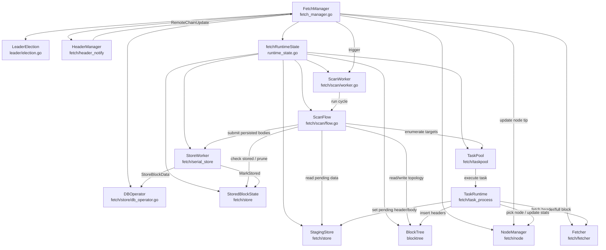

# `fetch/` package design

**Related:** [README.md](../README.md) · [BlockTree.md](BlockTree.md) · [FormalVerification.md](FormalVerification.md)

## 1. Overview



## 2. Core flow

```mermaid
sequenceDiagram
    participant LE as LeaderElection
    participant FM as FetchManager
    participant RT as fetchRuntimeState
    participant HM as HeaderManager
    participant NM as NodeManager
    participant SF as ScanFlow
    participant TP as TaskPool
    participant TR as TaskRuntime
    participant FE as Fetcher
    participant BT as BlockTree
    participant SS as StagingStore
    participant DS as StoredBlockState
    participant SW as StoreWorker
    participant DB as DBOperator
    participant SC as ScanWorker

    LE->>FM: onBecameLeader
    FM->>FM: createRuntimeState
    FM->>RT: allocate fresh T / P / D / workers
    FM->>DB: LoadBlockWindowFromDB(ctx)
    alt DB window non-empty
        FM->>BT: restoreBlockTree
        FM->>SS: SetPendingHeader(hash, nil)
        FM->>DS: MarkStored(complete rows)
        FM->>SF: PruneStoredBlocks(if needed)
    else DB window empty
        FM->>SF: EnsureBootstrapHeader()
        SF->>FE: FetchBlockHeaderByHeight
        SF->>BT: insertHeader(topology)
    end

    FM->>HM: Start()
    FM->>TP: Start()
    FM->>SC: SetEnabled(true) + Start()

    HM-->>FM: RemoteChainUpdate(header optional)
    FM->>NM: UpdateNodeChainInfo
    opt header present and leader active
        FM->>TR: InsertTreeHeader(header-only update)
        TR->>BT: insertHeader(topology)
    else header absent but hash present
        FM->>TR: SyncHeaderByHash(blockHash)
        TR->>FE: FetchBlockHeaderByHash
        TR->>BT: insertHeader(topology)
    end
    FM->>SC: Trigger()

    SC->>SF: RunScanCycle(ctx)
    SF->>SF: getHeaderByHeightSyncTargets
    SF->>SF: getHeaderByHashSyncTargets
    SF->>SF: build low-to-high branches

    par header by height
        SF->>TP: EnqueueHeaderHeightTask
    and header by hash
        SF->>TP: EnqueueHeaderHashTask
    and body
        SF->>TP: enqueue missing-body tasks
        SF->>SW: SubmitBranches(branches)
    end

    TP->>TR: HandleTaskPoolTask(task)
    TR->>FE: FetchBlockHeader / FetchFullBlock
    TR->>BT: InsertTreeHeader(if needed)
    TR->>TP: enqueue body task for inserted headers
    TR->>SS: SetPendingHeader / SetPendingBody

    SW->>SS: read branch node body payload
    SW->>DB: StoreBlockData(ctx, blockData)
    SW->>DS: MarkStored(hash)
    SF->>SF: PruneStoredBlocks
    SF->>SS: DeleteBlock(hash)
    SF->>DS: UnmarkStored(hash)
    SF->>TP: DelTask(hash)
```

## 3. File responsibilities

- **Scheduling & lifecycle**
  - `fetch_manager.go`: leader callbacks, runtime bootstrap, trigger control
- `scan/flow.go`: target enumeration, low-to-high branch materialization, body-task backfill for missing payloads, async stage execution, stage logging
  - `scan/worker.go`: periodic/triggered scan execution
- **Nodes & chain head**
  - `fetch/node`: node readiness, latency, best-node selection
  - `fetch/header_notify`: subscribe/poll for new heads and push updates
- **Fetch & conversion**
  - `fetcher.go` / `eth_protocol.go`: RPC fetch for header/full block
  - `convert.go` / `cache_erc20.go` / `cache_erc721.go`: conversion and caches
- **Tree & state**
  - `blocktree` package: fork topology, orphan linking, prune, thread-safe API
  - `staging_block_store.go`: `StagingStore`, pending headers/bodies by hash
  - `restore/runtime.go`: rebuild tree from DB window
  - `scan/prune_runtime.go`: prune policy for already-stored blocks
  - `stored_block_state.go`: set of persisted block hashes
- **Task execution**
  - `taskpool/pool.go`: dedupe, priority queue, workers, retries, metrics
- `task_process`: body/header fetch, tree insertion, body-task trigger on inserted headers, and write-back to `StagingStore`
- **Storage**
  - `store/db_operator.go`: DB window read and block persistence via `DBOperator`
  - `serial_store/serial_worker.go`: serialized write pipeline

## 4. Concurrency model

- `BlockTree` is internally locked; callers use its methods only.
- `StagingStore` is owned by runtime state; it maps hash → pending header/body.
- `BlockTree.Branches()` returns each branch leaf-first, so branch-local node order is high → low at the API boundary.
- `scan/flow.go` only materializes low → high branch sequences from `BlockTree` and hands those branches to `serial_store/serial_worker.go`.
- `scan/flow.go` may re-enqueue body tasks for branch nodes whose payload is still missing, but it does not traverse the branch node-by-node for persistence decisions.
- `task_process/runtime.go` enqueues body tasks for headers newly inserted into `BlockTree`, so header progression continues to feed body fetch independently of `serial_store`.
- `serial_store/serial_worker.go` is responsible for branch-local traversal: parent-persisted checks, treating a pruned-away parent as an acceptable branch root, DB writes, and stopping only the current branch when a node is blocked or fails.
- Header sync dedupes along two axes: `headerHeightsSyncing` (by height) and `headerHashesSyncing` (by hash).
- Whether body sync runs is decided by target enumeration plus task-pool dedupe, not a single global boolean.
- `BlockTree.Insert` rule: if `root` is set, headers with height ≤ `root.Height` are rejected.
- Scan is triggered by: periodic ticker (1s), `HeaderNotifier` updates, and `triggerScan` after body sync completes.
