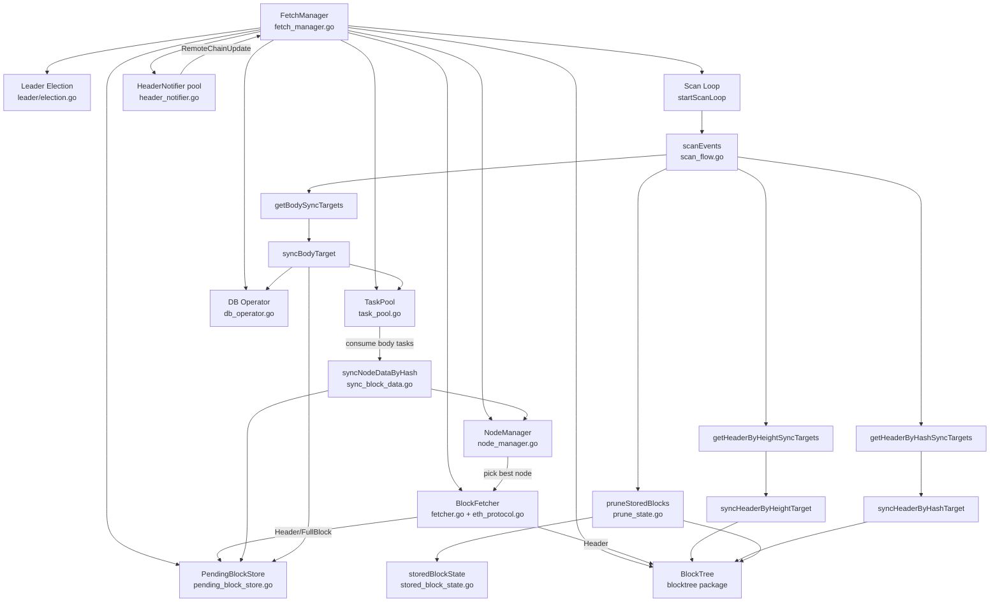
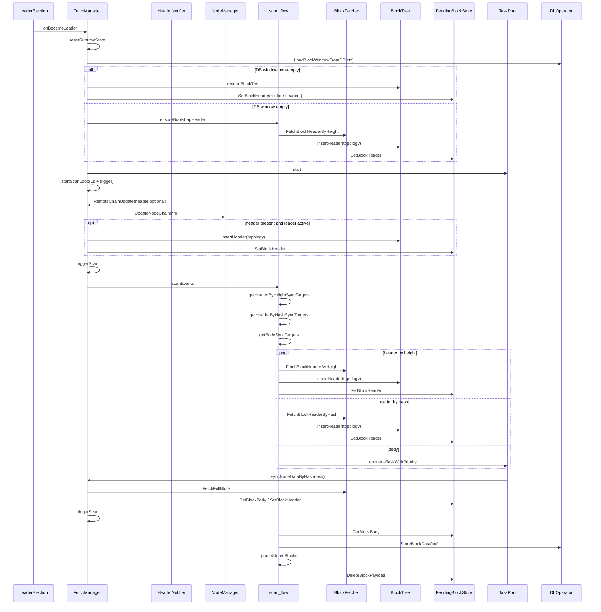

# `fetch/` package design

**Related:** [README.md](../README.md) · [BlockTree.md](../BlockTree.md) · [FormalVerification.md](../FormalVerification.md) · [README.md in this folder](README.md) (`doc/` index) · [test_report_2026-04-23.md](test_report_2026-04-23.md) (latest coverage) · [test_report_2026-04-13.md](test_report_2026-04-13.md) (historical)

## 1. Overview

## 2. Core flow

## 3. File responsibilities

- **Scheduling & lifecycle**
  - `fetch_manager.go`: leader callbacks, scan loop, trigger control, runtime reset
  - `scan_flow.go`: target enumeration (height/hash/body), async stage execution, stage logging
- **Nodes & chain head**
  - `node_manager.go`: node readiness, latency, best-node selection
  - `header_notifier.go`: subscribe/poll for new heads and push updates
  - `remote_chain.go`: per-node remote tip height/hash cache
- **Fetch & conversion**
  - `fetcher.go` / `eth_protocol.go`: RPC fetch for header/full block
  - `convert.go` / `cache_erc20.go` / `cache_erc721.go`: conversion and caches
- **Tree & state**
  - `blocktree` package: fork topology, orphan linking, prune, thread-safe API
  - `pending_block_store.go`: `PendingBlockStore`, pending headers/bodies by hash
  - `restore_tree.go`: rebuild tree from DB window
  - `prune_state.go`: prune policy for already-stored blocks
  - `stored_block_state.go`: set of persisted block hashes
- **Task execution**
  - `task_pool.go`: dedupe, priority queue, workers, retries, metrics
  - `sync_block_data.go`: body fetch and write-back to `PendingBlockStore`
- **Storage**
  - `db_operator.go`: DB window read and block persistence
  - `store_worker.go`: batched write pipeline

## 4. Concurrency model

- `BlockTree` is internally locked; callers use its methods only.
- `PendingBlockStore` is owned by `FetchManager`; it maps hash → pending header/body.
- Header sync dedupes along two axes: `headerHeightsSyncing` (by height) and `headerHashesSyncing` (by hash).
- Whether body sync runs is decided by target enumeration plus task-pool dedupe, not a single global boolean.
- `BlockTree.Insert` rule: if `root` is set, headers with height ≤ `root.Height` are rejected.
- Scan is triggered by: periodic ticker (1s), `HeaderNotifier` updates, and `triggerScan` after body sync completes.
