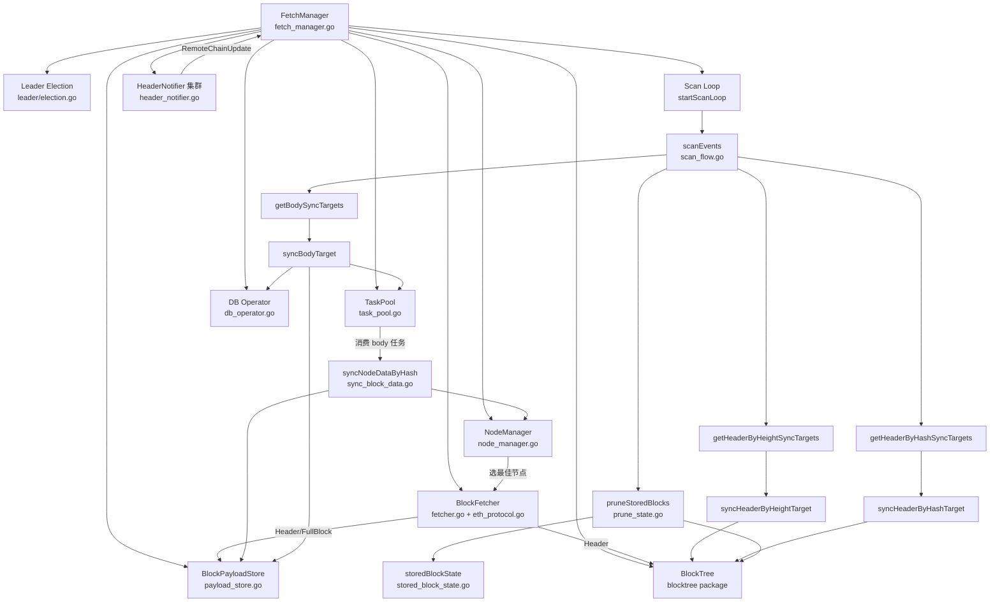
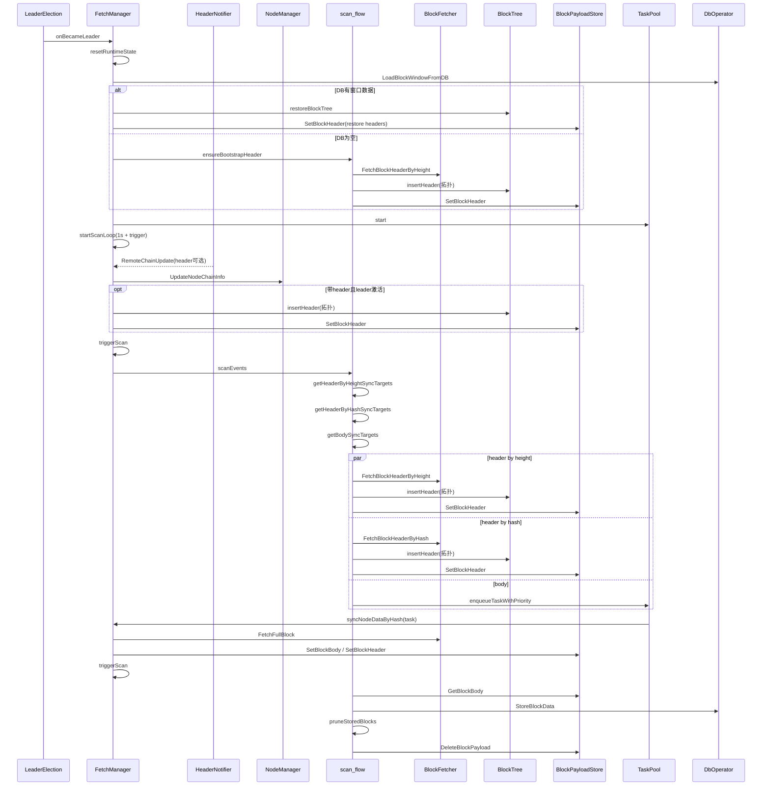

# fetch 目录整体架构图

## 1. 总览

## 2. 核心流程

## 3. 目录内职责映射

- 调度与生命周期
  - fetch_manager.go: Leader 回调、扫描循环、触发控制、运行时重置
  - scan_flow.go: 目标枚举（height/hash/body）、异步 stage 执行、阶段日志
- 节点与链头
  - node_manager.go: 节点可用性、延迟、最佳节点选择
  - header_notifier.go: 订阅/轮询新区块头并推送更新
  - remote_chain.go: 单节点远端链高度/哈希缓存
- 数据抓取与转换
  - fetcher.go / eth_protocol.go: RPC 协议抓取 header/full block
  - convert.go / cache_erc20.go / cache_erc721.go: 转换与缓存
- 树与状态
  - blocktree package: 仅负责分叉拓扑、孤块挂接、修剪、线程安全
  - payload_store.go: BlockPayloadStore，按 hash 缓存区块头/区块体
  - restore_tree.go: DB窗口恢复到树
  - prune_state.go: 已存储块裁剪策略
  - stored_block_state.go: 已落库 hash 集
- 任务执行
  - task_pool.go: 任务去重、优先级队列、worker、重试、指标
  - sync_block_data.go: body 拉取与写回 BlockPayloadStore
- 存储
  - db_operator.go: DB窗口读取与块数据落库
  - store_worker.go: 数据写入工作流

## 4. 当前并发模型

- BlockTree 内部加锁，外部通过方法访问。
- BlockPayloadStore 由 FetchManager 持有，按 hash 管理区块头/区块体。
- Header 同步按维度去重：
  - 高度维度: headerHeightsSyncing
  - hash 维度: headerHashesSyncing
- Body 是否执行通过目标枚举 + 任务池去重判断，不依赖单一布尔状态。
- BlockTree 插入约束：当 root 非空时，不接受高度小于等于 root.Height 的数据。
- 触发源有三类：
  - 定时 ticker(1s)
  - HeaderNotifier 到达
  - body 同步完成后 triggerScan
