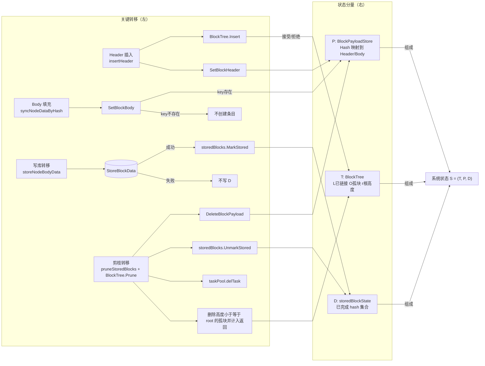
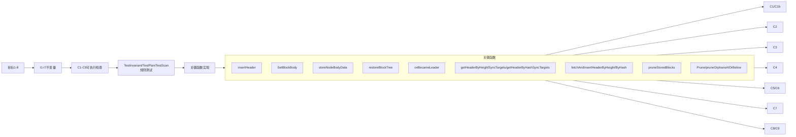
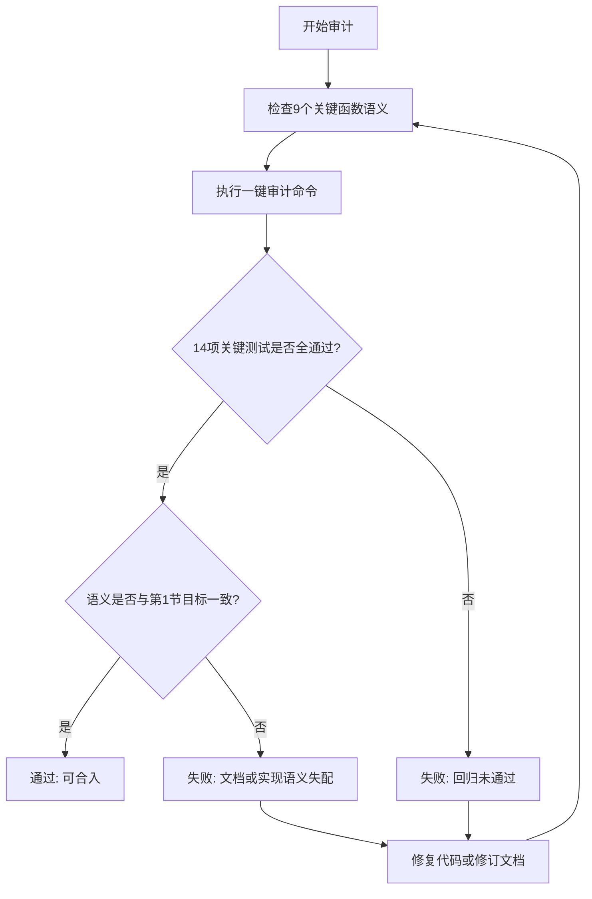

# Fetch 数据流形式化验证

## 1. 目标陈述

验证以下系统行为在实现中成立：

1. Header 插入时先尝试进入区块树；若插入被拒绝，树状态保持不变。
2. BlockPayloadStore 承载待处理的区块头与区块体缓存，不对“未入库全集”作充要声明。
3. storedBlockState 记录已完成 hash，来源包含运行期写库成功与启动恢复时的 Complete 记录。
4. 在 leader 运行态下，节点满足 parentReady 且 body 可存储时，Store 成功后写入 storedBlockState。
5. 剪枝返回集合中的 hash 必须在 BlockPayloadStore、storedBlockState 与 taskPool 中同步清理。
6. 剪枝时额外移除高度小于等于 root 高度的孤块，并把这些孤块计入 Prune 返回结果。
7. leader 切换为 active 时，优先从数据库窗口读取并初始化 blocktree；数据库窗口为空时回退远端 startHeight 引导。
8. 扫描阶段基于 blocktree 当前状态枚举“按高度/按 hash”头同步目标，并分别执行按高度/按 hash 的区块头同步收敛。

## 2. 状态模型

定义全局状态：

$$
S = (T, P, D)
$$

其中：

1. 区块树状态
$$
T = (L, O, r)
$$
L 表示已链接节点集合，O 表示孤块集合，r 表示当前 root 高度。

2. BlockPayloadStore
$$
P: Hash \to (Header, Body)
$$
若某 hash 在 P 中不存在，则视为没有待处理 payload。

3. storedBlockState
$$
D \subseteq Hash
$$
D 表示系统认定为“已完成”的 hash 集，来源包括：

1. 运行期写库成功后加入。
2. 启动恢复时来自 DB 窗口且 Complete=true 的记录加入。

### 2.1 StoredBlockState 操作语义（实现映射）

文档中的 StoredBlockState 对应实现类型 `storedBlockState`（文件 `fetch/stored_block_state.go`），其状态为：

$$
D = \{k \mid k \in \text{hashes map 的 key 集合}\}
$$

并满足以下转移语义：

1. `Reset()`
$$
D' = \varnothing
$$

2. `IsStored(hash)`：令 $k = normalizeHash(hash)$
$$
IsStored(hash)=
\begin{cases}
false, & k = "" \\
k \in D, & k \neq ""
\end{cases}
$$

3. `MarkStored(hash)`：令 $k = normalizeHash(hash)$
$$
D'=
\begin{cases}
D, & k = "" \\
D \cup \{k\}, & k \neq ""
\end{cases}
$$

4. `UnmarkStored(hash)`：令 $k = normalizeHash(hash)$
$$
D'=
\begin{cases}
D, & k = "" \\
D \setminus \{k\}, & k \neq ""
\end{cases}
$$

5. 并发语义：`storedBlockState` 通过互斥锁串行化读写，等价于对上述转移的线性化执行；`MarkStored` 在 `hashes == nil` 时惰性初始化 map，保证零值实例可安全使用。

## 3. 关键转移关系

### 3.1 Header 插入转移

输入 header h，键为 k。

1. 执行 BlockTree.Insert(height, k, parent, weight, ...)。
2. 执行 BlockPayloadStore.SetBlockHeader(k, h)。

结果：

1. 若插入被树接受，则 k 进入 L 或 O（取决于父是否可链接）。
2. 若插入被树拒绝（例如重复 key、高度不满足约束），T 可能不变。
3. 当前实现中，P[k].Header 仍会被设置（insertHeader 先调用 Insert，再无条件 SetBlockHeader）。

对应实现：

1. fetch/sync_block_data.go 中 insertHeader。
2. fetch/fetch_manager.go 中 startHeaderNotifiersAndConsumer 的 insertHeader 调用。

### 3.2 Body 填充转移

输入 hash 为 k 的 full block 转换结果 b。

1. syncNodeDataByHash 先确认节点存在于树中。
2. 构造 EventBlockData。
3. setNodeBlockBody(k, b)。

约束：

SetBlockBody 在 P 中不存在 k 时不创建新条目，直接返回。

对应实现：

1. fetch/sync_block_data.go。
2. fetch/fetch_manager.go。
3. fetch/payload_store.go。

### 3.3 入库转移

当节点满足 parentReady 且 body 可存储时：

1. StoreBlockData(blockData)。
2. 若成功，storedBlockState.MarkStored(k)。

对应实现：

fetch/scan_flow.go 中 storeNodeBodyData。

### 3.4 剪枝转移

1. 调用 BlockTree.Prune(count) 返回 prunedNodes。
2. 对每个返回节点 k：
   - BlockPayloadStore.DeleteBlockPayload(k)
   - storedBlockState.UnmarkStored(k)
   - taskPool.delTask(k)

此外，Prune 内部会删除所有满足 height <= root.Height 的孤块，并将其也放入 prunedNodes。

对应实现：

1. blocktree/block_tree.go。
2. fetch/prune_state.go。

### 3.5 启动恢复转移（DB 初始化树）

leader 获得后执行：

1. `LoadBlockWindowFromDB()` 读取窗口。
2. 调用 `restoreBlockTree(windowBlocks)`。
3. 若窗口非空且恢复成功，则以恢复结果初始化树与 stored 状态。
4. 若窗口为空，则调用 `ensureBootstrapHeader()` 通过 `startHeight` 远端拉头完成最小引导。

对应实现：

1. fetch/fetch_manager.go 的 `onBecameLeader`。
2. fetch/restore_tree.go 的 `restoreBlockTree`。
3. fetch/scan_flow.go 的 `ensureBootstrapHeader`。

### 3.6 区块头同步目标枚举与执行转移（高度/hash）

扫描协调器每轮执行：

1. 基于 `blockTree.HeightRange`、窗口目标和节点最新高度枚举高度目标：`getHeaderByHeightSyncTargets()`。
2. 基于 `blockTree.UnlinkedNodes` 枚举缺失父哈希目标：`getHeaderByHashSyncTargets()`。
3. 将目标分别入队 header-height/header-hash 任务。
4. worker 对应执行 `fetchAndInsertHeaderByHeightCore` 或 `fetchAndInsertHeaderByHashCore`，成功后触发下一轮扫描。

对应实现：

1. fetch/scan_flow.go 的 `runScanCoordinator`。
2. fetch/scan_flow.go 的 `getHeaderByHeightSyncTargets` / `getHeaderByHashSyncTargets`。
3. fetch/scan_flow.go 的 `handleTaskPoolTask`。
4. fetch/scan_flow.go 的 `fetchAndInsertHeaderByHeight(Core)` / `fetchAndInsertHeaderByHash(Core)`。

## 4. 不变量

### I1 入库正确性不变量

$$
\forall k,\ k \in D \Rightarrow (\text{曾成功执行过 StoreBlockData(k)}\ \lor\ \text{恢复时来自 Complete 记录})
$$

理由：

1. 运行期 add 在 StoreBlockData 成功后执行。
2. restoreBlockTree 在 blk.Complete 为 true 时也会 add。

### I2 BlockPayloadStore 非凭空创建 body

$$
\forall k,\ k \notin dom(P) \Rightarrow SetBlockBody(k, b) \text{ 不改变 } P
$$

理由：SetBlockBody 在 key 不存在时直接返回。

### I3 剪枝同步清理不变量

设一次剪枝返回集合为 R。

$$
\forall k \in R,\ k \notin D \land k \notin dom(P)
$$

理由：prune_state 对 R 逐个执行 del 与 DeleteBlockPayload。

### I4 孤块高度约束不变量

剪枝后，设新 root 高度为 r。

$$
\forall o \in O,\ height(o) > r
$$

理由：Prune 内部已删除所有 height <= r 的孤块。

### I5 StoredBlockState 规范化闭包不变量

$$
\forall k \in D,\ k = normalizeHash(k) \land k \neq ""
$$

理由：`MarkStored`/`IsStored`/`UnmarkStored` 均先执行 `normalizeHash`，并且空 key 直接返回，不会进入集合 D。

### I6 高度头同步目标边界与去重不变量

记本轮高度目标集合为 $H_t$，窗口目标大小为 $W$，树当前范围为 $[s,e]$，远端最新高度为 $L$。

当树非空且窗口可扩展时：

$$
\forall h \in H_t,\ e < h \le \min\big(e + (W-(e-s+1)),\ L\big)
$$

并满足：

$$
\forall h \in H_t,\ \neg isHeaderHeightSyncing(h)
$$

当树为空时：

$$
H_t = \{startHeight\}\ \text{或}\ H_t=\varnothing\ (\text{当该高度已处于 syncing})
$$

理由：`getHeaderByHeightSyncTargets` 由 `HeightRange`、`headerWindowTargetSize`、`GetLatestHeight` 和 header-height 去重状态共同约束。

### I7 hash 头同步目标合法性与去重不变量

记本轮 hash 目标集合为 $Q_t$，`UnlinkedNodes` 集为 $U$。

$$
\forall q \in Q_t,\ q \in normalize(U) \land q \neq "" \land blockTree.Get(q)=nil \land \neg isHeaderHashSyncing(q)
$$

理由：`getHeaderByHashSyncTargets` 仅从缺失父节点集合中筛选，且通过 `shouldSyncOrphanParent` 与 header-hash 去重状态过滤。

## 5. 保持性验证

### 5.1 Header 插入保持性

该转移只影响 T 与 P 的 header 部分，不会直接修改 D，因此不破坏 I1。
同时不涉及 SetBlockBody，不影响 I2。

注：该转移允许出现 “P 中有 header 但 T 中无对应节点” 的短期或持久状态（取决于后续是否被接纳或清理），该行为与当前实现一致。

### 5.2 Body 填充保持性

在 k 不存在于 P 时不写入，直接保持 I2。
在 k 存在时仅更新 P[k].Body，不影响 I1 与 I4。

### 5.3 入库保持性

仅当 StoreBlockData 成功时写 D，故保持 I1。
失败路径不写 D，也不破坏 I1。

### 5.4 剪枝保持性

由于 Prune 返回了被删除 linked 节点和满足条件的孤块，随后 prune_state 对返回项统一清理 P 与 D，故 I3 保持。
同时 Prune 内部对孤块执行 height 阈值删除，故 I4 保持。

### 5.5 启动恢复保持性

当 DB 窗口存在时，`restoreBlockTree` 把拓扑恢复到 T，并把 Complete 记录同步到 D；当 DB 窗口为空时，`ensureBootstrapHeader` 至少建立起根节点所需头信息。
两条路径均不破坏 I2、I3、I4，并为后续扫描提供可收敛初始态。

### 5.6 区块头同步枚举/执行保持性

基于 blocktree 的高度/hash 目标枚举只生成“尚需同步”的头目标；执行成功路径统一落在 `insertHeader`，因此与 5.1 的结论一致。
失败路径不会污染 D，仅影响后续重试，不破坏 I1-I5。

## 6. 与目标的一致性结论

目标 1 到目标 8 均与当前实现一致：

1. Header 插入时先尝试进入区块树；若被拒绝，树状态不变。
2. BlockPayloadStore 承载待处理的区块头/区块体缓存。
3. storedBlockState 记录已完成 hash（运行期成功写库或恢复 Complete）。
4. leader 运行态下，满足 parentReady 且 body 可存储的节点在 Store 成功后写入 storedBlockState。
5. 剪枝返回集合中的 hash 在 BlockPayloadStore、storedBlockState 与 taskPool 中同步清理。
6. 剪枝时会移除高度小于等于 root 的孤块，并将其计入返回集合。
7. onBecameLeader 优先 DB 初始化树，DB 为空时回退远端引导。
8. 扫描阶段按 blocktree 枚举高度/hash 头同步目标，并分别执行同步收敛。

## 7. 代码映射清单

1. fetch/fetch_manager.go
2. fetch/sync_block_data.go
3. fetch/scan_flow.go
4. fetch/payload_store.go
5. fetch/prune_state.go
6. fetch/stored_block_state.go
7. blocktree/block_tree.go

### 7.1 验证项到代码函数映射（审计追踪）

| 验证项 | 主函数 | 关键协同函数 | 说明 |
|---|---|---|---|
| C1 Header 插入正路径 | `FetchManager.insertHeader` | `BlockTree.Insert` / `BlockPayloadStore.SetBlockHeader` | 正路径下 T 与 P 同步存在 |
| C1b Header 插入拒绝路径 | `FetchManager.insertHeader` | `BlockTree.Insert` / `BlockPayloadStore.SetBlockHeader` | Insert 拒绝时 T 不变但 P 仍可写 |
| C2 Body 不凭空创建 | `BlockPayloadStore.SetBlockBody` | `BlockPayloadStore.GetBlockBody` | key 不存在时不隐式创建条目 |
| C3 仅成功写库或恢复 Complete 入 D | `FetchManager.storeNodeBodyData` / `FetchManager.restoreBlockTree` | `storedBlockState.MarkStored` | 覆盖运行期写库与恢复期 Complete 两来源 |
| C4 剪枝同步清理 P/D/task | `FetchManager.pruneStoredBlocks` | `BlockPayloadStore.DeleteBlockPayload` / `storedBlockState.UnmarkStored` / `taskPool.delTask` | 对剪枝返回集合执行一致清理 |
| C5 剪枝返回包含被删孤块 | `BlockTree.Prune` | `BlockTree.pruneOrphansAtOrBelow` | 阈值内孤块被删除且计入返回集合 |
| C6 剪枝后孤块高度约束 | `BlockTree.Prune` | `BlockTree.pruneOrphansAtOrBelow` | 剪枝后剩余孤块满足 `height > root.Height` |
| C7 leader 启动优先 DB 初始化树 | `FetchManager.onBecameLeader` | `LoadBlockWindowFromDB` / `restoreBlockTree` / `ensureBootstrapHeader` | DB 非空走恢复，DB 为空走远端引导 |
| C8 基于 blocktree 枚举高度头目标 | `FetchManager.getHeaderByHeightSyncTargets` | `HeightRange` / `headerWindowTargetSize` / `GetLatestHeight` | 仅生成窗口内且未同步的高度目标 |
| C9 基于 blocktree 枚举 hash 头目标并同步 | `FetchManager.getHeaderByHashSyncTargets` | `UnlinkedNodes` / `fetchAndInsertHeaderByHash(Core)` | 仅对缺失父 hash 生成并执行同步 |

## 8. 机器可执行验证清单

以下检查项可直接转化为单元测试或集成测试断言。

### C1 Header 插入正路径（树与 Pending 同步存在）

前置：构造合法 header h，hash 为 k。

检查：

1. 调用 insertHeader(h) 后，blockTree.Get(k) 非空。
2. pendingPayloadStore.GetBlockHeader(k) 非空且哈希为 k。

通过条件：1 与 2 同时成立。

### C1b Header 插入拒绝路径（Pending 可存在而树不存在）

前置：

1. 树已存在 root。
2. 构造一个会被 Insert 拒绝的 header（例如 height <= root.Height）。

步骤：调用 insertHeader(rejectedHeader)。

检查：

1. blockTree.Get(k) 仍为 nil。
2. pendingPayloadStore.GetBlockHeader(k) 非 nil。

通过条件：1 与 2 同时成立。

### C2 Body 不会凭空创建 Pending 条目

前置：P 中不存在 k。

步骤：

1. 调用 pendingPayloadStore.SetBlockBody(k, body)。
2. 读取 pendingPayloadStore.GetBlockBody(k)。

通过条件：读取结果为 nil。

### C3 仅成功写库或恢复 Complete 才进入 storedBlockState

前置：

1. 处于 leader 运行态的扫描/处理路径。
2. 树中存在节点 k，且 pendingPayloadStore 中存在可存储 body。
3. 使用 mockDbOperator，分别构造成功与失败两种返回。

检查：

1. DB 成功时，storedBlocks.IsStored(k) 为 true。
2. DB 失败时，storedBlocks.IsStored(k) 为 false。
3. 恢复路径对 Complete=true 的记录会加入 storedBlocks。

通过条件：

1. 运行期写库分支满足 1 与 2。
2. 恢复分支满足 3。

### C4 剪枝后 Pending、stored 与 taskPool 同步删除

前置：

1. 先构造可触发 prune 的树形。
2. 对预期会被剪掉的节点集合 R，预先写入 pending、stored 与 taskPool。

步骤：执行 pruneStoredBlocks。

检查：

1. 对任意 k in R，pendingPayloadStore.GetBlockHeader(k) 与 GetBlockBody(k) 均为 nil。
2. 对任意 k in R，storedBlocks.IsStored(k) 为 false。
3. 对任意 k in R，taskPool.hasTask(k) 为 false。

通过条件：

1. Pending 与 stored 清理满足 1 与 2。
2. taskPool 清理由独立流程测试满足 3。

### C5 剪枝返回包含被移除孤块

前置：

1. 构造已链接主链，确保 prune 后 root 高度为 r。
2. 构造两个孤块：o1 满足 height(o1) <= r，o2 满足 height(o2) > r。

步骤：执行 BlockTree.Prune。

检查：

1. 返回集合包含 o1，不包含 o2。
2. orphanKeySet 中 o1 被删除，o2 仍存在。

通过条件：1 与 2 同时成立。

### C6 剪枝后孤块高度约束

前置：构造存在多组孤块的树并触发 prune。

检查：

1. 获取 prune 后 root 高度 r。
2. 遍历 orphanParentToChild 中剩余孤块，断言其高度均大于 r。

通过条件：

$$
\forall o \in O_{after},\ height(o) > r
$$

### C7 leader 启动优先 DB 初始化树，空窗口回退远端

前置：构造两组场景（DB 窗口非空 / DB 窗口为空）。

检查：

1. DB 非空：`onBecameLeader` 后 `restoreBlockTree` 被使用，且 blocktree 非空。
2. DB 为空：`onBecameLeader` 后通过远端 `startHeight` 拉头引导，blocktree 非空。

通过条件：两组场景均可进入可扫描状态。

### C8 基于 blocktree 枚举高度头目标并执行同步

前置：给定已有根和远端最新高度，且窗口未达目标大小。

检查：

1. `getHeaderByHeightSyncTargets` 返回连续缺口高度集合。
2. 执行同步后 `HeightRange` 向最新高度扩展或达到窗口上限。

形式化谓词：

$$
H_t = getHeaderByHeightSyncTargets(T_t, W, L, Sync_t)
$$

若 $T_t$ 非空且窗口可扩展：

$$
H_t = \{h \mid e < h \le U_t\} \setminus Sync_t^H,
\quad U_t = \min\big(e + (W-(e-s+1)),\ L\big)
$$

若 $T_t$ 为空：

$$
H_t = \{startHeight\} \setminus Sync_t^H
$$

执行收敛条件（成功路径）：

$$
\forall h \in H_t,\ sync\_height(h)=success \Rightarrow h \in heights(T_{t+1})
$$

通过条件：谓词成立，且同步后高度范围按窗口规则单调推进或达到上限。

### C9 基于 blocktree 枚举 hash 头目标并执行同步

前置：树中存在 orphan 子节点，父 hash 缺失。

检查：

1. `getHeaderByHashSyncTargets` 包含缺失父 hash。
2. 执行 hash 同步后，父子关系可链接，orphan 减少或消失。

形式化谓词：

$$
Q_t = getHeaderByHashSyncTargets(U_t, Sync_t^Q)
= \{ normalize(p) \mid p \in U_t,\ shouldSyncOrphanParent(p)\} \setminus Sync_t^Q
$$

执行收敛条件（成功路径）：

$$
\forall q \in Q_t,\ sync\_hash(q)=success \Rightarrow q \in keys(T_{t+1})
$$

且对依赖该父的子节点集合 $Child(q)$：

$$
\exists c \in Child(q),\ parent(c)=q \Rightarrow c \text{ 从 unlinked 向 linked 收敛}
$$

通过条件：谓词成立，且缺失父 hash 回填后 orphan 集大小不增并趋于收敛。

## 9. 建议落地测试命名

建议在现有测试体系中保持以下命名风格：

1. TestInvariantHeaderInsertThenPending
2. TestInvariantSetBlockBodyNoImplicitCreate
3. TestInvariantStoredOnlyAfterSuccessfulStore
4. TestInvariantPruneDeletesPendingAndStored
5. TestInvariantPruneReturnsRemovedOrphans
6. TestInvariantOrphansAboveRootAfterPrune
7. TestOnBecameLeaderUsesDBBootstrapWithoutRemoteFetch
8. TestOnBecameLeaderFallsBackToRemoteBootstrapWhenDBEmpty
9. TestSyncHeaderWindowAndSyncOrphanParents
10. TestGetHeaderByHeightSyncTargetsFormalPredicates
11. TestGetHeaderByHashSyncTargetsFormalPredicates
12. TestHeaderHashSyncFailureLeavesTargetRetryable
13. TestHeightSyncAdvancesExactlyByDerivedTargets

## 10. 验证项与测试映射

以下映射用于审计 C1-C9 是否已经工程化落地。

| 验证项 | 测试函数 | 测试文件 | 覆盖对象 | 通过标准 | 当前状态 |
|---|---|---|---|---|---|
| C1 Header 插入正路径（树与 Pending 同步存在） | TestInvariantHeaderInsertThenPending | fetch/invariant_formal_test.go | Header 插入链路正路径 | blockTree.Get(k) 非空且 pending header 非空 | 已落地/通过 |
| C1b Header 插入拒绝路径（Pending 可存在而树不存在） | TestInvariantHeaderInsertRejectedStillWritesPendingHeader | fetch/invariant_formal_test.go | Header 插入链路拒绝路径 | blockTree.Get(k) 为空且 pending header 非空 | 已落地/通过 |
| C2 Body 不会凭空创建 Pending 条目 | TestInvariantSetBlockBodyNoImplicitCreate | fetch/invariant_formal_test.go | BlockPayloadStore.SetBlockBody | key 不存在时 GetBlockBody(k) 仍为 nil | 已落地/通过 |
| C3 仅成功写库或恢复 Complete 才进入 storedBlockState | TestInvariantStoredOnlyAfterSuccessfulStore / TestRestoreBlockTreeLoadsWindowAndCompleteState | fetch/invariant_formal_test.go / fetch/fetch_manager_scan_test.go | storeNodeBodyData + storedBlockState + restoreBlockTree | 运行期: DB 成功 MarkStored、DB 失败不 MarkStored；恢复期: Complete 会 MarkStored | 已落地/通过 |
| C4 剪枝后 Pending、stored 与 taskPool 同步删除 | TestInvariantPruneDeletesPendingAndStored / TestScanEventsRule5PruneRemovesStoredAndTasks | fetch/invariant_formal_test.go / fetch/fetch_manager_scan_test.go | pruneStoredBlocks 后处理 + task 清理链路 | 返回集合中的 hash 在 Pending/stored/taskPool 中被一致清理 | 已落地/通过 |
| C5 剪枝返回包含被移除孤块 | TestInvariantPruneReturnsRemovedOrphans | blocktree/invariant_formal_test.go | BlockTree.Prune 返回值 | 返回集合包含满足阈值被删孤块 | 已落地/通过 |
| C6 剪枝后孤块高度约束 | TestInvariantOrphansAboveRootAfterPrune | blocktree/invariant_formal_test.go | orphanParentToChild 保留项 | 所有剩余孤块高度均大于 root 高度 | 已落地/通过 |
| C7 leader 启动优先 DB 初始化树 | TestOnBecameLeaderUsesDBBootstrapWithoutRemoteFetch / TestOnBecameLeaderFallsBackToRemoteBootstrapWhenDBEmpty | fetch/fetch_manager_scan_test.go | onBecameLeader 启动分支 | DB 非空走恢复，DB 为空走远端回退 | 已落地/通过 |
| C8 基于 blocktree 枚举高度头目标并同步 | TestGetHeaderByHeightSyncTargetsFormalPredicates / TestScanEventsRule2WindowExpandsToDoubleIrreversible / TestSyncHeaderWindowAndSyncOrphanParents | fetch/cache_and_scan_helpers_test.go / fetch/fetch_manager_scan_test.go | 枚举性质: 高度目标边界/连续性/去重；执行收敛性质: 高度窗口拉头推进 | 高度范围按窗口规则推进，且目标边界/连续性/去重成立 | 已落地/通过 |
| C9 基于 blocktree 枚举 hash 头目标并同步 | TestGetHeaderByHashSyncTargetsFormalPredicates / TestHeaderHashSyncFailureLeavesTargetRetryable / TestScanEventsRule3SyncOrphanParentsByHash / TestSyncHeaderWindowAndSyncOrphanParents | fetch/cache_and_scan_helpers_test.go / fetch/fetch_manager_scan_test.go | 枚举性质: hash 目标合法性/去重；执行收敛性质: orphan 父回填、失败可重试 | 缺失父回填后子节点可链接，且目标合法性/去重/失败可重试成立 | 已落地/通过 |

### 10.1 断言锚点清单（审计用）

为避免“函数名已覆盖但断言不充分”的误判，补充每项验证的最小断言锚点：

1. C1：`blockTree.Get(k) != nil` 且 `pendingPayloadStore.GetBlockHeader(k) != nil`。
2. C1b：`blockTree.Get(k) == nil` 且 `pendingPayloadStore.GetBlockHeader(k) != nil`。
3. C2：对不存在 key 调用 `SetBlockBody` 后，`GetBlockBody(k) == nil`。
4. C3（运行期）：DB 成功时 `storedBlocks.IsStored(k)==true`，DB 失败时 `storedBlocks.IsStored(k)==false`。
5. C3（恢复期）：`restoreBlockTree` 后 Complete=true 的记录满足 `storedBlocks.IsStored(k)==true`。
6. C4（Pending/stored）：`pruneStoredBlocks` 后，返回集合中的 k 满足 Pending header/body 为空且 `storedBlocks.IsStored(k)==false`。
7. C4（taskPool）：剪枝流程后，被剪节点对应任务满足 `taskPool.hasTask(k)==false`。
8. C5：`Prune` 返回集合包含阈值内孤块，不包含阈值外孤块。
9. C6：`Prune` 后剩余孤块满足 `height(o) > root.Height`。
10. C7：`onBecameLeader` 在 DB 非空/为空两种情况下都能初始化为可扫描状态。
11. C8：`getHeaderByHeightSyncTargets` 的输出与窗口缺口一致，满足边界、连续性、去重，并在执行后推进高度范围。
12. C9：`getHeaderByHashSyncTargets` 发现缺失父 hash，满足合法性、去重，执行后 orphan 收敛，失败时目标仍可重试。

### 10.2 C8/C9 断言模板（可直接落地到单测）

以下模板将 C8/C9 的形式化谓词映射为可执行断言，便于在测试中直接复用。

1. C8-模板A（高度目标边界）
   - 输入：当前树范围 $[s,e]$、窗口目标 $W$、远端高度 $L$。
   - 期望上界：
$$
U_t = \min\big(e + (W-(e-s+1)),\ L\big)
$$
   - 断言：`targets := getHeaderByHeightSyncTargets()` 后，`targets` 中每个 `h` 满足 `e < h && h <= U_t`。

2. C8-模板B（高度目标连续性）
   - 输入：同模板A，且无高度去重命中。
   - 断言：`targets` 等于 `[e+1, e+2, ..., U_t]` 的连续序列；长度为 `max(0, U_t-e)`。

3. C8-模板C（高度目标去重）
   - 输入：先将某些高度标记为 syncing。
   - 断言：这些高度不出现在 `targets` 中；非 syncing 的缺口高度仍保留。

4. C8-模板D（高度同步收敛）
   - 输入：为 `targets` 中高度提供可成功返回的 mock header。
   - 断言：执行同步后，`HeightRange` 的 `end` 单调不减，且达到 `min(L, e+|targets|)` 或窗口上限。

5. C9-模板A（hash 目标合法性）
   - 输入：构造 orphan 子节点，缺失父 hash 集为 `U`。
   - 断言：`targets := getHeaderByHashSyncTargets()` 中每个 `q` 满足：`q != ""`、`blockTree.Get(q)==nil`、且 `q` 来自 `normalize(U)`。

6. C9-模板B（hash 目标去重）
   - 输入：先将部分缺失父 hash 标记为 syncing。
   - 断言：这些 hash 不出现在 `targets` 中；未标记的缺失父仍在 `targets`。

7. C9-模板C（hash 同步收敛）
   - 输入：为 `targets` 提供可成功返回的 mock parent header。
   - 断言：执行同步后，`blockTree.Get(parentHash) != nil`，且依赖该父的 orphan 子节点可被链接（`UnlinkedNodes` 数量不增并趋于减少）。

8. C9-模板D（失败路径稳定性）
   - 输入：令部分 hash 同步失败（返回 nil）。
   - 断言：失败 hash 不会错误写入树，不会污染 stored 状态；下一轮仍可作为候选目标重试。

### 10.3 C8/C9 模板覆盖清单

下表用于回答“10.2 中每条模板当前由哪些测试覆盖，覆盖是完整还是部分完整”。

| 模板 | 主要测试 | 覆盖状态 | 说明 |
|---|---|---|---|
| C8-模板A（高度目标边界） | TestGetHeaderByHeightSyncTargetsFormalPredicates | 完整覆盖 | 显式断言空树 startHeight 引导、窗口上界和 latest height 上界 |
| C8-模板B（高度目标连续性） | TestGetHeaderByHeightSyncTargetsFormalPredicates | 完整覆盖 | 显式断言 `targets == [e+1, ..., U_t]` 的连续序列 |
| C8-模板C（高度目标去重） | TestGetHeaderByHeightSyncTargetsFormalPredicates | 完整覆盖 | 显式设置 height syncing 状态并验证目标过滤 |
| C8-模板D（高度同步收敛） | TestHeightSyncAdvancesExactlyByDerivedTargets / TestScanEventsRule2WindowExpandsToDoubleIrreversible / TestSyncHeaderWindowAndSyncOrphanParents | 完整覆盖 | 显式比较 `len(targets)` 与 `HeightRange` 推进量，并由现有测试补充窗口推进收敛路径 |
| C9-模板A（hash 目标合法性） | TestGetHeaderByHashSyncTargetsFormalPredicates | 完整覆盖 | 显式断言 target 非空、树中不存在、且来自缺失父集合 |
| C9-模板B（hash 目标去重） | TestGetHeaderByHashSyncTargetsFormalPredicates | 完整覆盖 | 显式设置 hash syncing 状态并验证过滤 |
| C9-模板C（hash 同步收敛） | TestScanEventsRule3SyncOrphanParentsByHash / TestSyncHeaderWindowAndSyncOrphanParents | 完整覆盖 | 显式验证缺失父回填后父子链接收敛 |
| C9-模板D（失败路径稳定性） | TestHeaderHashSyncFailureLeavesTargetRetryable | 完整覆盖 | 显式验证失败不污染 tree/stored，且下一轮仍可重试 |

补充说明：

1. “完整覆盖”表示测试已直接对应该模板的关键断言。
2. “部分覆盖”表示测试验证了主要行为，但未完全按模板中的理论边界做逐项断言。
3. 当前 C8/C9 模板已全部达到“完整覆盖”。

执行建议：

1. 仅验证形式化测试: go test ./fetch -run TestInvariant -count=1 && go test ./blocktree -run TestInvariant -count=1
2. 仓库回归验证: go test ./... -count=1 && go build ./...

## 11. 变更影响面与非覆盖风险

### 11.1 影响面

本次形式化验证与测试落地主要覆盖以下模块：

1. fetch/payload_store.go
2. fetch/stored_block_state.go
3. fetch/scan_flow.go
4. fetch/prune_state.go
5. fetch/sync_block_data.go
6. blocktree/block_tree.go

### 11.2 已覆盖的关键风险

1. Header 入树与 Pending 记录偏离
2. Body 写入时隐式创建 payload 条目
3. DB 写失败后误标记 stored
4. 剪枝后 Pending/stored/taskPool 残留脏数据
5. 被删孤块未计入 Prune 返回值
6. 剪枝后仍存在高度小于等于 root 的孤块

### 11.3 尚未完全覆盖的风险

1. 并发竞争风险：
   - BlockPayloadStore 已增加锁保护，并完成 go test ./... -race 回归。
   - 若未来引入新的无锁共享状态（尤其跨 goroutine 的临时聚合变量），仍需持续维持 race 流水线守护。
2. 长时间运行下的内存边界：
   - 对异常分叉或持续孤块流量场景，缺少专项容量上限测试。
3. 失败恢复一致性：
   - DB 间歇性失败与重试交错场景下，Pending 与 taskPool 的长期一致性仍以集成行为为主，缺少故障注入型长时测试。
4. 外部依赖抖动：
   - HeaderNotifier 和远端节点状态抖动下的最终一致性，当前主要通过现有连续场景测试覆盖，形式化断言级测试仍可增强。

### 11.4 建议后续补充

1. 增加 race 检测流水线：go test ./... -race
2. 增加故障注入测试：
   - DB 连续失败 N 次后恢复
   - Header 拉取超时与乱序返回
3. 增加容量与压力场景：
   - 大规模 orphan 持续注入
   - 高频 prune 与 write 并发交替

## 12. 后续测试计划表

| 编号 | 测试主题 | 目标 | 执行步骤 | 通过标准 | 预估耗时 | 对应测试函数 | 当前状态 |
|---|---|---|---|---|---|---|---|
| P1 | 并发竞争检测 | 发现 BlockPayloadStore、storedBlockState、taskPool 相关数据竞争 | 1) 执行 go test ./... -race 2) 收集并修复 race 报告 3) 回归 go test ./... | 无 race 报告，回归全绿 | 0.5-1 天 | go test ./... -race（全仓执行） | 已落地/通过 |
| P2 | DB 故障注入恢复 | 验证 DB 连续失败后恢复时，stored 与 pending 一致性 | 1) mock DB 连续失败 N 次 2) 第 N+1 次成功 3) 观察 stored/pending/taskPool 状态收敛 | 失败阶段不误标记 stored；恢复后可继续入库并收敛 | 1 天 | TestPlanP2DBIntermittentFailureThenRecovery | 已落地/通过 |
| P3 | Header 拉取抖动 | 验证 header 超时、乱序、重试下的最终一致性 | 1) 模拟子块先到、父块首次失败后恢复 2) 重试插入父块 3) 检查树结构和 pending header 收敛 | 最终树结构可链接；parent-child 关系正确；pending header 一致 | 1 天 | TestPlanP3HeaderFetchTimeoutAndDisorderConverges | 已落地/通过 |
| P4 | Orphan 容量压力 | 验证大量孤块持续注入时系统边界与清理正确性 | 1) 注入大批 orphan（多父节点）2) 周期性补父并剪枝 3) 观测 orphan 集大小与内存趋势 | orphan 集随父补全与剪枝下降；无异常增长或错误删除 | 1-2 天 | TestPlanP4OrphanCapacityPressureConverges | 已落地/通过 |
| P5 | 高频剪枝与写入交替 | 验证 prune 与 store 高频交替时一致性 | 1) 构造连续链并预置 payload 2) 多轮执行 processBranchesLowToHigh + pruneStoredBlocks 3) 校验 tree/pending/stored 一致性 | 已剪节点在 tree/pending/stored 中一致清理；stored 不含悬空 hash | 1 天 | TestPlanP5FrequentPruneAndStoreAlternationConsistency | 已落地/通过 |

执行顺序建议：P2 -> P3 -> P5 -> P4（已全部完成）。

P1 本次修复摘要：

1. BlockPayloadStore 增加读写锁，消除 map 并发读写竞争。
2. 扫描流程相关测试中的并发计数与写入断言改为原子/互斥保护，避免测试桩竞争噪声。
3. StoreFullBlock 的任务投递与完成收敛改为同步等待，并修复 InitStore 中全局 channel 变量遮蔽问题。

## 13. 已知设计选择与可选改造

### 13.1 已知设计选择

当前实现在 `insertHeader` 路径中采用“先尝试 Insert，再无条件 SetBlockHeader”的策略。

语义后果：

1. 正路径：树中存在节点，Pending 中也存在 header。
2. 拒绝路径：树中不存在节点，但 Pending 中可能存在 header。

该行为已通过 C1/C1b 对应测试显式固化，不应在评审中被误判为偶发缺陷。

### 13.2 可选改造方案

可选方案：仅当 Insert 成功时写入 BlockPayloadStore.SetBlockHeader。

潜在收益：

1. 降低 P 与 T 的状态分歧。
2. 简化部分形式化约束与审计口径。

潜在影响：

1. 可能改变当前部分恢复/重试路径对 header 缓存的可见性。
2. 需要回归验证 `restore_tree`、`sync_block_data`、`scan_flow` 相关流程。

建议：在单独变更中执行该改造，并新增迁移前后对照测试后再启用。

## 14. 变更影响快速审计步骤（5分钟版）

用于代码评审或发布前快速确认 C1-C9 未被回归破坏。

### 14.1 必看函数（按顺序）

1. `fetch/sync_block_data.go` 中 `insertHeader`：确认“Insert 后 SetBlockHeader”的当前设计语义未被无意改变。
2. `fetch/payload_store.go` 中 `SetBlockBody`：确认 key 不存在时直接返回，不隐式创建。
3. `fetch/scan_flow.go` 中 `storeNodeBodyData`：确认仅在写库成功后 `storedBlocks.MarkStored`。
4. `fetch/restore_tree.go` 中 `restoreBlockTree`：确认 Complete=true 记录会进入 `storedBlocks`。
5. `fetch/fetch_manager.go` 中 `onBecameLeader`：确认 DB 非空走 `restoreBlockTree`，DB 为空走 `ensureBootstrapHeader`。
6. `fetch/scan_flow.go` 中 `runScanCoordinator` + `getHeaderByHeightSyncTargets` + `getHeaderByHashSyncTargets`：确认头同步目标来源于 blocktree 当前状态。
7. `fetch/scan_flow.go` 中 `fetchAndInsertHeaderByHeight(Core)` / `fetchAndInsertHeaderByHash(Core)`：确认高度/hash 两类头同步都能收敛进树。
8. `fetch/prune_state.go` 中 `pruneStoredBlocks`：确认对剪枝返回集合执行 Pending/stored/taskPool 一致清理。
9. `blocktree/block_tree.go` 中 `Prune` 与 `pruneOrphansAtOrBelow`：确认阈值内孤块删除并计入返回，且剪枝后孤块高度约束成立。

### 14.2 必跑测试（按顺序）

一键执行（推荐）：

1. 单行版本：
   `go test ./fetch -run 'TestInvariant(HeaderInsertThenPending|HeaderInsertRejectedStillWritesPendingHeader|SetBlockBodyNoImplicitCreate|StoredOnlyAfterSuccessfulStore|PruneDeletesPendingAndStored)|TestRestoreBlockTreeLoadsWindowAndCompleteState|TestOnBecameLeaderUsesDBBootstrapWithoutRemoteFetch|TestOnBecameLeaderFallsBackToRemoteBootstrapWhenDBEmpty|TestScanEventsRule2WindowExpandsToDoubleIrreversible|TestScanEventsRule3SyncOrphanParentsByHash|TestSyncHeaderWindowAndSyncOrphanParents|TestScanEventsRule5PruneRemovesStoredAndTasks' -count=1 && go test ./blocktree -run 'TestInvariant(PruneReturnsRemovedOrphans|OrphansAboveRootAfterPrune)' -count=1`
2. 可读版本：
   `go test ./fetch -run 'TestInvariant(HeaderInsertThenPending|HeaderInsertRejectedStillWritesPendingHeader|SetBlockBodyNoImplicitCreate|StoredOnlyAfterSuccessfulStore|PruneDeletesPendingAndStored)|TestRestoreBlockTreeLoadsWindowAndCompleteState|TestOnBecameLeaderUsesDBBootstrapWithoutRemoteFetch|TestOnBecameLeaderFallsBackToRemoteBootstrapWhenDBEmpty|TestScanEventsRule2WindowExpandsToDoubleIrreversible|TestScanEventsRule3SyncOrphanParentsByHash|TestSyncHeaderWindowAndSyncOrphanParents|TestScanEventsRule5PruneRemovesStoredAndTasks' -count=1`
   `go test ./blocktree -run 'TestInvariant(PruneReturnsRemovedOrphans|OrphansAboveRootAfterPrune)' -count=1`

逐条执行（审计留痕）：

1. `go test ./fetch -run TestInvariantHeaderInsertThenPending -count=1`
2. `go test ./fetch -run TestInvariantHeaderInsertRejectedStillWritesPendingHeader -count=1`
3. `go test ./fetch -run TestInvariantSetBlockBodyNoImplicitCreate -count=1`
4. `go test ./fetch -run TestInvariantStoredOnlyAfterSuccessfulStore -count=1`
5. `go test ./fetch -run TestRestoreBlockTreeLoadsWindowAndCompleteState -count=1`
6. `go test ./fetch -run TestInvariantPruneDeletesPendingAndStored -count=1`
7. `go test ./fetch -run TestScanEventsRule5PruneRemovesStoredAndTasks -count=1`
8. `go test ./fetch -run TestOnBecameLeaderUsesDBBootstrapWithoutRemoteFetch -count=1`
9. `go test ./fetch -run TestOnBecameLeaderFallsBackToRemoteBootstrapWhenDBEmpty -count=1`
10. `go test ./fetch -run TestScanEventsRule2WindowExpandsToDoubleIrreversible -count=1`
11. `go test ./fetch -run TestScanEventsRule3SyncOrphanParentsByHash -count=1`
12. `go test ./fetch -run TestSyncHeaderWindowAndSyncOrphanParents -count=1`
13. `go test ./blocktree -run TestInvariantPruneReturnsRemovedOrphans -count=1`
14. `go test ./blocktree -run TestInvariantOrphansAboveRootAfterPrune -count=1`

#### C8/C9 最小回归命令

用于只验证“头目标枚举与同步收敛”这一组性质，而不跑其它形式化项。

1. 单行版本：
   `go test ./fetch -run 'Test(GetHeaderByHeightSyncTargetsFormalPredicates|GetHeaderByHashSyncTargetsFormalPredicates|HeaderHashSyncFailureLeavesTargetRetryable|ScanEventsRule2WindowExpandsToDoubleIrreversible|ScanEventsRule3SyncOrphanParentsByHash|SyncHeaderWindowAndSyncOrphanParents)' -count=1`
2. 可读版本：
   `go test ./fetch -run TestGetHeaderByHeightSyncTargetsFormalPredicates -count=1`
   `go test ./fetch -run TestGetHeaderByHashSyncTargetsFormalPredicates -count=1`
   `go test ./fetch -run TestHeaderHashSyncFailureLeavesTargetRetryable -count=1`
   `go test ./fetch -run TestScanEventsRule2WindowExpandsToDoubleIrreversible -count=1`
   `go test ./fetch -run TestScanEventsRule3SyncOrphanParentsByHash -count=1`
   `go test ./fetch -run TestSyncHeaderWindowAndSyncOrphanParents -count=1`

### 14.3 通过判定

1. 上述 14 条测试全部通过。
2. `onBecameLeader`、`restoreBlockTree`、`getHeaderByHeightSyncTargets`、`getHeaderByHashSyncTargets`、`fetchAndInsertHeaderByHeight(Core)`、`fetchAndInsertHeaderByHash(Core)`、`insertHeader`、`SetBlockBody`、`storeNodeBodyData`、`pruneStoredBlocks`、`Prune` 的语义与第 1 节目标陈述一致。
3. 任一条不满足则视为“形式化验证链路失配”，需要补充代码修复或文档修订后再合入。

## 15. 关键图示

以下图示用于快速理解形式化验证的核心对象、验证闭环与审计执行路径。

### 15.1 状态模型与关键转移

### 15.2 验证闭环（目标 -> 不变量 -> 测试 -> 代码）

### 15.3 5分钟快速审计流程图

